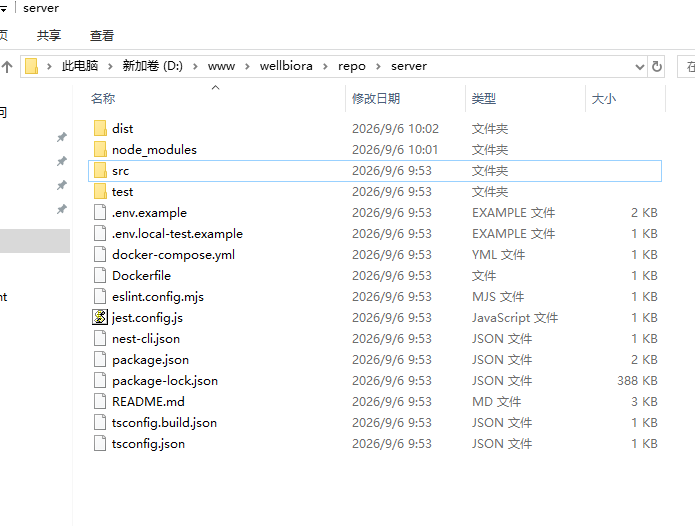
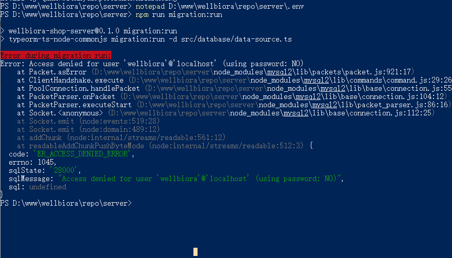
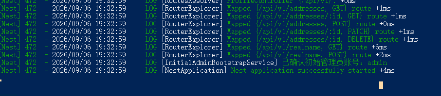
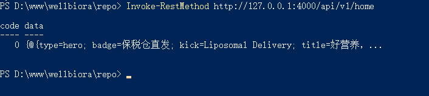

# WELLBIORA H5 商城 · 部署后端 server 教程（图解版）

> 对应《WELLBIORA-WindowsServer2019部署指南》**第十节**，2026-09-06 在生产服务器实测通过。
> 前置条件：Node 22 / Git / MySQL 8.4 已安装，代码已克隆到 `D:\www\wellbiora\repo`，MySQL 的 `wellbiora_shop` 库和 `wellbiora` 账号已按部署指南 6.4 节建好。
> 所有命令在 **PowerShell** 中执行。实测发现一个指南未写清的坑（迁移不读 `.env`），本文第四节有完整说明。

---

## 步骤一：安装依赖并构建（指南 10.1）

```powershell
cd D:\www\wellbiora\repo\server
npm ci
npm run build
```

- ⚠️ 用 `npm ci` 而不是 `npm install`：`npm ci` 严格按 `package-lock.json` 精确安装；且数据库迁移要用到开发依赖（ts-node），必须装全，不能加 `--production`。
- `npm ci` 成功标志：`added 728 packages in 55s`（实测值，时间因网络而异）。期间出现的 `npm warn deprecated ...` 是上游依赖版本公告，**警告不是错误，无视**。
- `npm run build`（即 `nest build`）编译期间**不打印任何内容**，安静几十秒后回到提示符、无红色 error 即成功。

完成后 `server` 目录应能看到 `dist\`（编译产物）和 `node_modules\`：



## 步骤二：先生成三个密钥（指南 10.3，故意提前）

指南把它编在 10.2（写 .env）之后，但 `.env` 模板里就要填这三个值，**先跑下面三条命令更顺手**。每条输出先粘到记事本暂存：

```powershell
# ① JWT_SECRET（登录令牌密钥，长随机串）
node -e "console.log(require('node:crypto').randomBytes(48).toString('hex'))"

# ② PERSONAL_DATA_KEY（身份证号 AES 加密密钥）
node -e "console.log(require('node:crypto').randomBytes(32).toString('base64'))"

# ③ ADMIN_INITIAL_PASSWORD（后台初始管理员密码，16 位随机）
node -e "console.log(require('node:crypto').randomBytes(12).toString('base64url'))"
```

⚠️ **`PERSONAL_DATA_KEY` 一旦投入使用就永远不能换**（换了历史身份证密文全部无法解密），生成后立即抄进线下密码本。第 ③ 条的输出就是以后 `/admin/` 后台的登录密码，同样要记下。

## 步骤三：创建生产配置 .env（指南 10.2）

```powershell
notepad D:\www\wellbiora\repo\server\.env
```

notepad 提示"文件不存在，是否创建"→ 点"是"，粘贴下面模板，**只改 4 个尖括号处（尖括号本身也要去掉）**：

```ini
NODE_ENV=production
PORT=4000
CORS_ORIGIN=http://wellbiora.com.cn

JWT_SECRET=<步骤二第①条输出>
PERSONAL_DATA_KEY=<步骤二第②条输出>

ADMIN_INITIAL_USERNAME=admin
ADMIN_INITIAL_PASSWORD=<步骤二第③条输出>

MYSQL_HOST=127.0.0.1
MYSQL_PORT=3306
MYSQL_USER=wellbiora
MYSQL_PASSWORD=<6.4节建账号时设的密码>
MYSQL_DATABASE=wellbiora_shop

ADMIN_LOGIN_MAX_FAILURES=5
ADMIN_LOGIN_LOCK_MINUTES=10
```

三个「不要」：

- **不要**设置 `LOCAL_TEST_MODE=1`（那是无数据库的内存测试模式，重启丢数据）；
- **不要**沿用 `.env.example` 里的占位密钥（后端启动时会故意报错拦截）；
- **不要**把这个文件提交 git 或泄露（它被 `.gitignore` 排除，永远不会随代码下载）。

## 步骤四：初始化数据库（指南 10.4）

```powershell
cd D:\www\wellbiora\repo\server
npm run migration:run
```

成功标志：输出 `10 migrations` 逐条 `executed`（create-users、create-sms-verification-tables……admin-order-management）。以后代码有新迁移时重跑此命令即可，已执行过的不会重复执行。

### ⚠️ 实测踩过的坑：`Access denied ... (using password: NO)`

老版本代码的迁移命令**不读 `.env` 文件**（它走独立的 TypeORM CLI，只认系统环境变量），数据库密码是空的，就会报下图这个错：



判断与处理：

- 关键看括号里 **`using password: NO`**（没带密码，是环境变量问题，不是密码错）：
  - **代码 ≥ `248e5df`**（2026-09-06 的修复，`data-source.ts` 已加 `import 'dotenv/config'`）：直接重跑即可，会自动读 `.env`；
  - **旧代码**：在**同一个 PowerShell 窗口**先注入再跑（密码用单引号包住）：

    ```powershell
    $env:MYSQL_PASSWORD = '你的wellbiora密码'
    npm run migration:run
    ```

- 如果括号里是 `using password: YES` 还报错：才是真密码不对，检查 `.env` 的 `MYSQL_PASSWORD` 与 6.4 节建账号时是否一致。

⚠️ 所以跑迁移前先确认代码是最新的：`git pull` 一下（服务器 Deploy key 只读，pull 没问题），`git log --oneline -1` 应该能看到包含上述修复的提交。

## 步骤五：手动冒烟测试（指南 10.5）

```powershell
cd D:\www\wellbiora\repo\server
node dist\main.js
```

启动成功的标志（保持这个窗口别关）：



- 一串 `Mapped {/api/v1/...} route` = 所有接口路由注册成功；
- **`已确认初始管理员账号: admin`** = 用 `.env` 里的密码自动创建了后台管理员（此密码即 `/admin/` 登录密码）；
- **`Nest application successfully started`** = 启动完成。

**另开一个 PowerShell 窗口**测接口：

```powershell
Invoke-RestMethod http://127.0.0.1:4000/api/v1/home
```

能返回内容块 JSON（第一个块是 hero，badge=保税仓直发）即整条链路（后端 → MySQL → 接口）全通：



测试完回到第一个窗口 **Ctrl + C 停止**（第十二节之后会用 NSSM 把它注册成 Windows 服务，不再手动跑）。

## 常见报错速查

| 报错 | 原因 | 处理 |
|---|---|---|
| `Access denied ... (using password: NO)` | 迁移命令没读到 `.env`（旧代码）或 `.env` 没保存成功 | 见步骤四：pull 最新代码，或 `$env:MYSQL_PASSWORD` 注入后重跑 |
| `Access denied ... (using password: YES)` | 密码真的不对 | 核对 `.env` 的 `MYSQL_PASSWORD` 与 6.4 节设置 |
| 启动时报 `生产环境缺少配置：xxx` | `.env` 漏填或变量名拼错 | 对照步骤三模板逐行检查 |
| `EADDRINUSE :::4000` 端口被占 | 上一个进程没停干净 | 任务管理器结束 node 进程，或换窗口重试 |
| 迁移卡住/连不上数据库 | MySQL 服务没启动 | `Get-Service MySQL84` 确认 Running |

---

> 与部署指南的关系：指南第十节是提纲；本文补充了实测细节（`npm ci` 的预期输出、密钥先生成再写 `.env` 的顺序调整、迁移不读 `.env` 的坑与修复版本判断、成功日志样例）。**以本文为准。**
