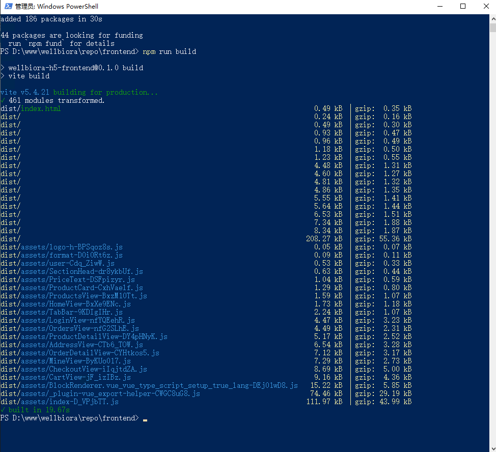
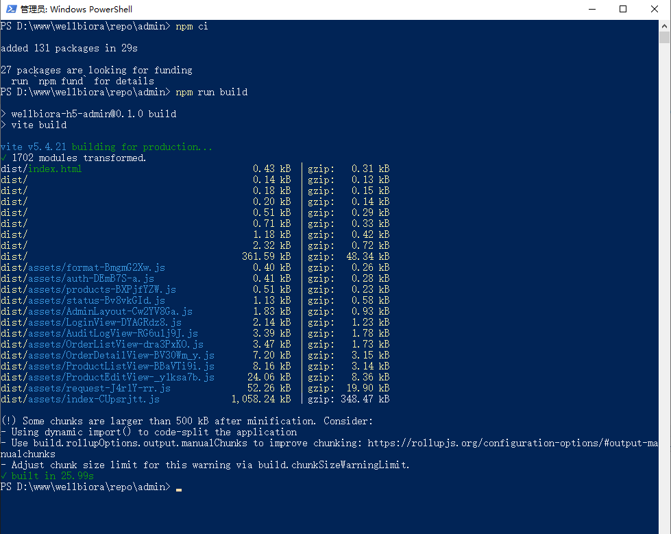
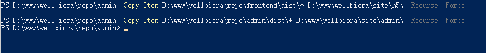

# WELLBIORA H5 商城 · 构建前端与管理后台教程（图解版）

> 对应《WELLBIORA-WindowsServer2019部署指南》**第十一节**，2026-09-06 在生产服务器实测通过。
> 前置条件：第十节后端已冒烟通过（接口能返回 JSON）。
> 所有命令在 **PowerShell** 中执行。两个 `npm ci` 各需约 30 秒 ~ 几分钟（视网络）。

---

## 前置说明：admin 挂 /admin/ 子路径的代码调整已内置

管理后台要挂在 `wellbiora.com.cn/admin/` 下运行，所需两处改动（`admin/vite.config.ts` 的 `base: '/admin/'`、路由的 `createWebHistory(import.meta.env.BASE_URL)`）**已提交进仓库**，直接构建即可，不需要改任何代码。

H5 商城（frontend）用的是 hash 路由（`/#/products`），放根路径天然可用，**同样不需要改**。

## 步骤一：构建 H5 商城（指南 11.2）

```powershell
cd D:\www\wellbiora\repo\frontend
Set-Content -Path .env.production -Value "VITE_USE_MOCK=0" -Encoding ascii
npm ci
npm run build
```

- 第一行**首次构建必做**：显式写死生产环境走真实接口、关掉 mock（`.env.production` 被 gitignore，不会随仓库下载，服务器上要手动创建一次）。以后更新版本若没删过这个文件，可跳过。
- `npm ci` 成功标志：`added 186 packages in 30s`（实测值）；`npm warn deprecated ...` 照旧无视。
- `npm run build` 成功标志：绿色 **`✓ built in 19.67s`**（实测），`✓ 460 modules transformed`，产物列表里有 `dist/index.html` 和一堆 `dist/assets/*.js`：



> 接口地址说明：前端请求走相对路径 `/api/v1`，由 Nginx 反代到后端 4000 端口，所以构建时**不需要**配置任何 API 域名。

## 步骤二：构建管理后台（指南 11.3）

```powershell
cd D:\www\wellbiora\repo\admin
npm ci
npm run build
```

成功标志：绿色 **`✓ built in 25.99s`**（实测），`✓ 1702 modules transformed`（Element Plus 全量引入所以模块数比 frontend 多很多）：



⚠️ 末尾出现的这段**是提示不是错误**，不要被吓到：

```
(!) Some chunks are larger than 500 kB after minification...
```

它只是建议做代码分割（admin 的 `index-*.js` 实测约 1 MB，gzip 后约 349 KB，内网管理后台完全可接受）。**看到 `✓ built in ...` 就算成功**，不用处理。

## 步骤三：把构建产物复制到站点目录（指南 11.4）

```powershell
Copy-Item D:\www\wellbiora\repo\frontend\dist\* D:\www\wellbiora\site\h5\ -Recurse -Force
Copy-Item D:\www\wellbiora\repo\admin\dist\* D:\www\wellbiora\site\admin\ -Recurse -Force
```



复制完验证（两条命令都应有 `index.html`、`assets\` 目录）：

```powershell
dir D:\www\wellbiora\site\h5
dir D:\www\wellbiora\site\admin
```

到这里前端两份静态产物就位。**注意此时打开域名还看不到页面** —— 还差第十二节的 Nginx 站点配置（静态托管 + `/api/` 反代 + `/admin/` 托管）。

## 以后如何更新版本

每次发新版本，重复本教程步骤一 ~ 步骤三即可（`git pull` → `npm ci`（依赖有变才需要）→ `npm run build` → `Copy-Item`），详见部署指南第十七节运维手册。

## 常见坑速查

| 现象 | 原因 | 处理 |
|---|---|---|
| 页面打开全是 mock 数据 | 忘建 `.env.production` 或值不是 `VITE_USE_MOCK=0` | 重新执行步骤一第一行，再 `npm run build` |
| admin 页面白屏、资源 404（路径变成 `/assets/...` 而非 `/admin/assets/...`） | 用了老代码构建（缺 `base: '/admin/'`） | `git pull` 最新代码后重新构建 |
| `npm run build` 报红色 error | 多为依赖没装全 | 先 `npm ci` 再 build；仍报错把整屏截图发出来 |
| `Copy-Item` 报路径不存在 | `site\h5` / `site\admin` 目录没建 | 按部署指南 3.2 节 `mkdir` 补齐 |

---

> 与部署指南的关系：指南第十一节是提纲；本文补充了实测输出样例、admin chunk 警告的定性（提示而非错误）、`.env.production` 的作用说明。**以本文为准。**
