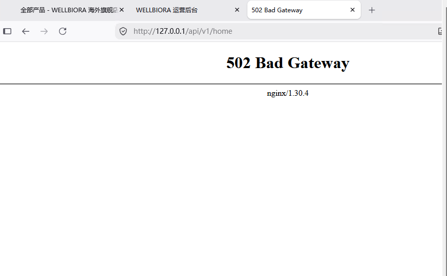
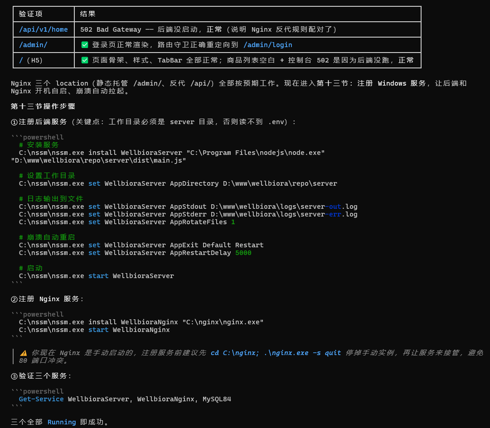

# WELLBIORA H5 商城 · Nginx 站点配置教程（图解版）

> 对应《WELLBIORA-WindowsServer2019部署指南》**第十二节**，2026-09-06 在生产服务器实测通过。
> 前置条件：第十一节完成（`site\h5`、`site\admin` 已有构建产物）；Nginx 1.30.4 已解压到 `C:\nginx`。
> 所有命令在**管理员 PowerShell** 中执行。

---

## 这份配置在干什么（架构回忆）

```
浏览器 → wellbiora.com.cn:80 → Nginx
                                ├─ /            → D:/www/wellbiora/site/h5   （H5 商城静态文件）
                                ├─ /admin/      → D:/www/wellbiora/site/admin （管理后台静态文件）
                                └─ /api/        → 127.0.0.1:4000              （反代到 NestJS 后端）
```

## 步骤一：编辑 nginx.conf

```powershell
notepad C:\nginx\conf\nginx.conf
```

在打开的文件里找到 **`http { }` 内部的默认 `server { ... }` 块**（特征：`listen 80;`、`server_name localhost;`，位于 `#gzip on;` 附近），从 `server {` 到它配对的 `}` **整个删掉**，替换为下面内容：

```nginx
    server {
        listen       80;
        server_name  wellbiora.com.cn;

        # ── H5 商城（根路径） ─────────────────────────────
        root  D:/www/wellbiora/site/h5;
        index index.html;

        location / {
            try_files $uri $uri/ /index.html;
        }

        # ── 管理后台（/admin/ 子路径） ─────────────────────
        # ⚠️ 必须用 ^~ 前缀匹配：下方静态资源缓存规则是正则匹配，
        #    优先级高于普通前缀，不加 ^~ 会导致 /admin/ 的 js/css 全部 404
        location ^~ /admin/ {
            alias D:/www/wellbiora/site/admin/;
            try_files $uri $uri/ /admin/index.html;
        }

        # ── 后端 API（反向代理到本机 4000） ────────────────
        location ^~ /api/ {
            proxy_pass http://127.0.0.1:4000;
            proxy_set_header Host              $host;
            proxy_set_header X-Real-IP         $remote_addr;
            proxy_set_header X-Forwarded-For   $proxy_add_x_forwarded_for;
            proxy_set_header X-Forwarded-Proto $scheme;
            proxy_read_timeout 60s;
        }

        # 上传体积限制（后台将来传图片用）
        client_max_body_size 10m;

        # 静态资源缓存（带 hash 的文件名可以长缓存）
        location ~* \.(js|css|png|jpg|jpeg|gif|webp|svg|woff2?)$ {
            expires 30d;
            add_header Cache-Control "public";
        }

        # 访问日志
        access_log  logs/wellbiora.access.log;
        error_log   logs/wellbiora.error.log;
    }
```

⚠️ 四个易错点（实测最容易翻车的地方）：

1. 只替换 `http { }` **里面的** server 块，文件开头 `worker_processes`、`http {` 等外层结构不动；
2. 默认配置里 `# HTTPS server` 注释段下的 443 示例 server 块保持**整段注释**状态，不要启用（现在还没上 HTTPS）；
3. Windows 路径一律写**正斜杠** `D:/www/wellbiora/...`；
4. `/admin/` 和 `/api/` 两个 location 的 **`^~` 一个都不能少**（原因见配置内注释）。

## 步骤二：检查配置并启动

```powershell
cd C:\nginx
.\nginx.exe -t
```

必须看到 `syntax is ok` 和 `test is successful` 两行才继续。

- **Nginx 在运行中**（之前手动启动过）：`.\nginx.exe -s reload` 重载配置；
- **Nginx 未运行**：`.\nginx.exe` 直接启动（窗口一闪而退是正常的，它以后台方式运行）。可用 `tasklist | findstr nginx` 确认进程存在。

## 步骤三：本机验证（三种预期各不相同，别看错）

| 访问 | 预期 | 说明 |
|---|---|---|
| `http://127.0.0.1/` | H5 首页能打开 | 纯静态托管已通；页面里的接口数据可能加载失败——**此时后端还没以服务方式运行，属预期** |
| `http://127.0.0.1/admin/` | 管理后台登录页能打开 | 验证 `^~ /admin/` + alias 生效 |
| `http://127.0.0.1/api/v1/home` | **502 Bad Gateway** | **这是对的**！后端进程未运行，Nginx 转发不到 4000 就该报 502（页脚会显示 nginx/1.30.4） |

实测截图（三个标签页正好对应三种预期）：



三个 location 的验证结果汇总（实测记录，含与第十三节的衔接）：



⚠️ 此阶段用 `wellbiora.com.cn` 从外网访问还打不开：系统防火墙和云安全组都还没放行 80 端口（第十四节处理），先用 `127.0.0.1` 本机验证。

## 常见坑速查

| 现象 | 原因 | 处理 |
|---|---|---|
| `nginx -t` 报 `unexpected "..."` | 粘贴时漏了分号 / 大括号没配对 / 删默认块没删干净 | 对照步骤一模板逐行核对；确认默认 server 块整块删除 |
| 启动失败：`bind() to 0.0.0.0:80 failed` | 80 端口被占（旧 nginx 进程残留或 IIS） | `tasklist \| findstr nginx` 清残留；IIS 服务停用 |
| admin 页面白屏、控制台 js/css 404 | `/admin/` 的 location 漏了 `^~` | 补上 `^~` 后 `nginx -s reload` |
| 首页能开但一直转圈没数据 | 后端未启动（还没做第十三节） | 正常，做完第十三节自然恢复 |
| 外网访问打不开、本机正常 | 防火墙 / 云安全组未放行 80 | 见部署指南第十四节 |

---

> 与部署指南的关系：指南第十二节是提纲；本文补充了替换范围、易错点和分阶段的预期结果。**以本文为准。**
