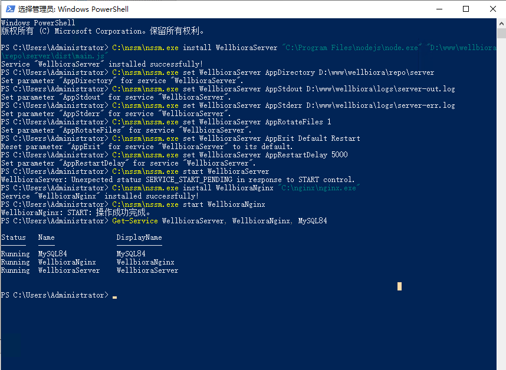
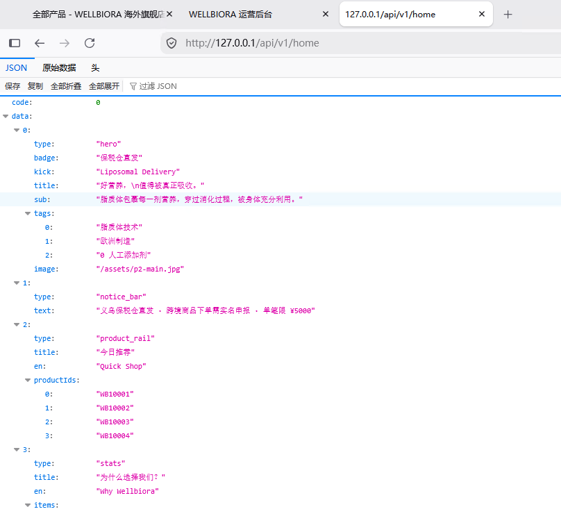

# WELLBIORA H5 商城 · NSSM 注册 Windows 服务教程（图解版）

> 对应《WELLBIORA-WindowsServer2019部署指南》**第十三节**，2026-09-06 在生产服务器实测通过。
> 前置条件：第十二节 Nginx 配置完成；后端已手动冒烟通过（第十节）。
> NSSM 使用 2.24-101-g897c7ad 预发布版（老 2.24 在 Win10/Server2016+ 有服务启动 bug），装在 `C:\nssm`。
> 所有命令在**管理员 PowerShell** 中执行。

---

## 为什么要做这一步

手动 `node dist\main.js` 跑的后端：窗口一关就没了、崩了没人拉、服务器重启全下线。用 NSSM 注册成 Windows 服务后：**开机自启、崩溃 5 秒自动重启、日志落盘**——这就是"生产形态"。

## 步骤零：先停掉所有手动实例（关键前置）

```powershell
# 1) 手动跑的 node：去那个窗口 Ctrl+C；确认无残留：
tasklist | findstr node

# 2) 手动启动的 nginx：必须停，否则服务启动时 80 端口冲突
C:\nginx\nginx.exe -s stop
```

⚠️ 这步漏做是本节最常见翻车点：服务安装成功但一直起不来，报端口占用。

## 步骤一：注册后端服务 WellbioraServer

```powershell
# 1. 安装服务（服务名、程序、启动参数）
C:\nssm\nssm.exe install WellbioraServer "C:\Program Files\nodejs\node.exe" "D:\www\wellbiora\repo\server\dist\main.js"

# 2. 设置工作目录（读取 .env 的关键）
C:\nssm\nssm.exe set WellbioraServer AppDirectory D:\www\wellbiora\repo\server

# 3. 日志输出到文件（出问题看这里）
C:\nssm\nssm.exe set WellbioraServer AppStdout D:\www\wellbiora\logs\server-out.log
C:\nssm\nssm.exe set WellbioraServer AppStderr D:\www\wellbiora\logs\server-err.log
C:\nssm\nssm.exe set WellbioraServer AppRotateFiles 1

# 4. 崩溃自动重启（5 秒后拉起）
C:\nssm\nssm.exe set WellbioraServer AppExit Default Restart
C:\nssm\nssm.exe set WellbioraServer AppRestartDelay 5000

# 5. 启动
C:\nssm\nssm.exe start WellbioraServer
```

⚠️ 每条成功都会回显 `Set parameter "xxx" for service "WellbioraServer".`——逐条核对。

其中 **AppDirectory 是灵魂**：后端靠"当前目录"找到 `server\.env`，漏设或设错就会重现第十节那个 `生产环境缺少配置` 报错。

## 步骤二：注册 Nginx 服务 WellbioraNginx

```powershell
C:\nssm\nssm.exe install WellbioraNginx "C:\nginx\nginx.exe"
C:\nssm\nssm.exe start WellbioraNginx
```

## 步骤三：验证三个服务

```powershell
Get-Service WellbioraServer, WellbioraNginx, MySQL84
```

三个全部 `Status = Running` 即成功：



> 实测小知识：`start` 后可能提示 `Unexpected status SERVICE_START_PENDING in response to START control`——这只是启动中的过渡状态提示，几秒后自动转正，**以 Get-Service 的最终结果为准**。

## 步骤四：整站验收（502 应当消失）

浏览器刷新三个地址：

| 访问 | 之前（手动实例停掉后） | 现在（服务化后） |
|---|---|---|
| `http://127.0.0.1/api/v1/home` | 502 Bad Gateway | **完整 JSON**（hero/notice_bar/product_rail 等内容块） |
| `http://127.0.0.1/` | 首页空壳、接口报错 | 首页带出商品数据 |
| `http://127.0.0.1/admin/` | 仅登录页可开 | 登录页 + 用 `admin` 和 `.env` 里的 `ADMIN_INITIAL_PASSWORD` 可真实登录 |



至此，**服务器本机视角整站已完整可运行**，且具备开机自启能力（NSSM 注册的服务默认自启类型，可在 `services.msc` 图形界面核对/启停）。

## 服务的日常管理（记这几条就够）

```powershell
C:\nssm\nssm.exe restart WellbioraServer    # 更新后端代码后重启
C:\nssm\nssm.exe stop    WellbioraServer    # 停止
C:\nssm\nssm.exe start   WellbioraServer    # 启动
Restart-Service WellbioraNginx                   # Nginx 改配置后重启服务生效（2026-09-07 实测：服务模式下 nginx -s reload 报 Access denied，须改用本命令）
Get-Content D:\www\wellbiora\logs\server-err.log -Tail 50   # 后端报错日志
```

## 常见坑速查

| 现象 | 原因 | 处理 |
|---|---|---|
| 服务装上了但一直不 Running | 80/4000 端口被手动进程占用 | 步骤零重做；`tasklist` 清残留进程 |
| 后端服务秒退、反复重启 | 启动报错（缺配置/连不上库） | 看 `D:\www\wellbiora\logs\server-err.log` 末尾 |
| 报 `生产环境缺少配置：xxx` | AppDirectory 没设/设错，读不到 `.env` | 重跑步骤一第 2 条后 `restart` |
| 接口依旧 502 | 后端服务没在 Running | `Get-Service WellbioraServer` 确认后 restart |
| 外网打不开、本机正常 | 防火墙/安全组未放行 80 | 见部署指南第十四节（与本节无关） |

---

> 与部署指南的关系：指南第十三节是提纲；本文补充了"先停手动实例"的前置、`SERVICE_START_PENDING` 的定性、验收前后对比和日志排查入口。**以本文为准。**
