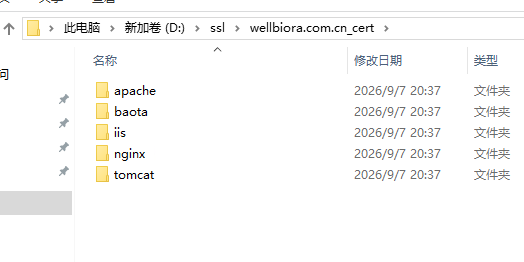
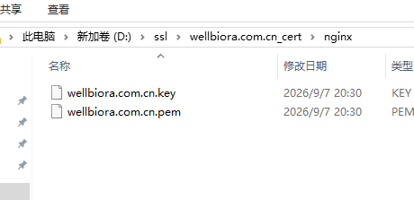

# WELLBIORA H5 商城 · HTTPS 部署教程（实测版）

> 对应《WELLBIORA-WindowsServer2019部署指南》**第十六节**，2026-09-07 在生产服务器实测完成并验证通过。
> 前置条件：第十三节服务化完成、HTTP 整站已跑通。
> 本次证书：**单域名 DV 证书**，只覆盖 `wellbiora.com.cn`，**不含 `www.wellbiora.com.cn`**。
> 所有命令在**管理员 PowerShell** 中执行。

---

## 为什么要做这一步

前期 HTTP 可以跑通整站，但**接入微信支付前必须上 HTTPS**（微信支付回调地址强制 HTTPS + 备案域名）。本次切换赶在支付联调之前完成。

## 第一步：认识证书包（只用 nginx 文件夹）

证书品牌商下载下来是一个「多服务器类型」压缩包，解压后是 5 个文件夹——**同一张证书的不同格式**，分别给不同 Web 服务器用：

| 文件夹 | 给谁用 | 我们用吗 |
|---|---|---|
| `nginx` | Nginx | ✅ **只用这个** |
| `apache` | Apache | 无视 |
| `iis` | Windows IIS | 无视 |
| `tomcat` | Tomcat（Java） | 无视 |
| `baota` | 宝塔面板 | 无视 |



打开 `nginx` 文件夹，里面应该正好两个文件：

- `wellbiora.com.cn.pem` —— 证书链（有的厂商叫 `.crt`，效果一样）
- `wellbiora.com.cn.key` —— 私钥



> ⚠️ 整个证书包里**每个文件夹都含一份私钥副本**。部署验证成功后，建议把解压的源文件夹删掉或移走，别长期留在显眼位置。

## 第二步：放置证书文件

```powershell
mkdir C:\nginx\ssl
copy <你的证书包路径>\nginx\wellbiora.com.cn.pem C:\nginx\ssl\
copy <你的证书包路径>\nginx\wellbiora.com.cn.key C:\nginx\ssl\
```

> 人话：`.pem` 是"对外出示的身份证"，`.key` 是"只有自己有的密码本"，两者配对才能开启 HTTPS。统一放 `C:\nginx\ssl\`，以后续期直接覆盖这里。

## 第三步：修改 nginx.conf（三 server 块）

用记事本打开 `C:\nginx\conf\nginx.conf`，把原 `listen 80` 的 server 块替换为下面**三个块**（本次实际采用的配置，含 www 跳主域名）：

```nginx
    # ── HTTP：全部跳转到 HTTPS 主域名 ──
    server {
        listen       80;
        server_name  wellbiora.com.cn www.wellbiora.com.cn;
        return 301 https://wellbiora.com.cn$request_uri;
    }

    # ── HTTPS：www 跳转到主域名 ──
    server {
        listen       443 ssl;
        server_name  www.wellbiora.com.cn;
        ssl_certificate      C:/nginx/ssl/wellbiora.com.cn.pem;
        ssl_certificate_key  C:/nginx/ssl/wellbiora.com.cn.key;
        return 301 https://wellbiora.com.cn$request_uri;
    }

    # ── HTTPS：正式站点 ──
    server {
        listen       443 ssl;
        http2        on;
        server_name  wellbiora.com.cn;

        ssl_certificate      C:/nginx/ssl/wellbiora.com.cn.pem;
        ssl_certificate_key  C:/nginx/ssl/wellbiora.com.cn.key;
        ssl_protocols        TLSv1.2 TLSv1.3;
        ssl_ciphers          HIGH:!aNULL:!MD5;
        ssl_session_cache    shared:SSL:10m;
        ssl_session_timeout  10m;

        root  D:/www/wellbiora/site/h5;
        index index.html;

        location / {
            try_files $uri $uri/ /index.html;
        }

        location ^~ /admin/ {
            alias D:/www/wellbiora/site/admin/;
            try_files $uri $uri/ /admin/index.html;
        }

        location ^~ /api/ {
            proxy_pass http://127.0.0.1:4000;
            proxy_set_header Host              $host;
            proxy_set_header X-Real-IP         $remote_addr;
            proxy_set_header X-Forwarded-For   $proxy_add_x_forwarded_for;
            proxy_set_header X-Forwarded-Proto $scheme;
            proxy_read_timeout 60s;
        }

        client_max_body_size 10m;

        location ~* \.(js|css|png|jpg|jpeg|gif|webp|svg|woff2?)$ {
            expires 30d;
            add_header Cache-Control "public";
        }

        access_log  logs/wellbiora.access.log;
        error_log   logs/wellbiora.error.log;
    }
```

三个易错点：

1. **路径必须用正斜杠 `/`**：`C:/nginx/ssl/...`（写成反斜杠会报错）；
2. 证书文件名如果与上面不同（比如带日期后缀），把 `ssl_certificate` 两行改成实际文件名；
3. 443 块里的 root / location 整段，是从原 80 块**原样复制**过来的，不要漏。

### 单域名证书的 www 限制（重要认知）

「HTTPS www 跳主域名」那个块**只在用户已忽略证书警告硬进来时**才起作用。因为证书里没有 www，用户访问 `https://www.wellbiora.com.cn` 时，Nginx 还没看清请求就得先把证书递出去，浏览器会**先弹证书不安全警告**，点"继续访问"后才轮到 301 跳转。所以：

- `http://www.wellbiora.com.cn`（80 那个块）→ 跳转正常好用 ✅
- `https://www.wellbiora.com.cn` → 必先弹证书警告 ⚠️

**真正干净的做法是 DNS 里不解析 www 记录**，让用户只能走裸域名。H5、后台、未来的微信支付目录都用 `wellbiora.com.cn` 裸域名。

## 第四步：生效（本节最大坑）

```powershell
cd C:\nginx
.\nginx.exe -t          # 语法检查，必须 syntax is ok
```

`-t` 通过后，按指南原文是执行 `.\nginx.exe -s reload`——**但实测会报错**：

```text
nginx: [error] OpenEvent("Global\ngx_reload_5512") failed (5: Access is denied)
```

原因：我们的 Nginx 是通过 NSSM 注册成 **Windows 服务**跑的，服务进程与普通 PowerShell 窗口不在同一会话，普通窗口（甚至管理员窗口）没有权限给它发 reload 信号。**这不是配置错误**，换通知方式即可：

```powershell
Restart-Service WellbioraNginx
# 或：C:\nssm\nssm.exe restart WellbioraNginx
```

服务重启有几秒中断，之后配置生效。

## 第五步：改后端跨域并重启（不做则接口全挂）

后端有"允许谁来调用我"的白名单 `CORS_ORIGIN`，还写着 http。网站切到 https 后浏览器带的身份对不上，表现是**页面能打开但所有接口被拦**（商品加载不出来、登录下单全挂）。

```powershell
# 编辑 D:\www\wellbiora\repo\server\.env，把
#   CORS_ORIGIN=http://wellbiora.com.cn
# 改为
#   CORS_ORIGIN=https://wellbiora.com.cn
C:\nssm\nssm.exe restart WellbioraServer
```

## 第六步：放行 443（两道门都要开，最易漏）

80 和 443 是两道独立的门，之前只开了 80：

```powershell
netsh advfirewall firewall add rule name="WELLBIORA-HTTPS-443" dir=in action=allow protocol=TCP localport=443
```

再去**阿里云控制台 → ECS → 安全组 → 入方向**，添加 TCP 443 放行（与当初加 80 同一处操作）。

漏开的现象：服务器本机 `https://127.0.0.1` 能打开，但外网访问一直转圈超时。

> 查看已有防火墙规则的图形入口：`Win+R` → `wf.msc` → 左侧「入站规则」，能看到 `WELLBIORA-HTTPS-443` 等全部规则，右键可删改。

## 第七步：验收清单

| 访问地址 | 预期 |
|---|---|
| `https://wellbiora.com.cn` | 地址栏锁图标；首页商品正常刷出（同时验证了 CORS 已改对） |
| `http://wellbiora.com.cn` | 自动跳到 `https://` |
| `https://wellbiora.com.cn/admin/` | 后台能登录、订单列表能加载 |
| `http://www.wellbiora.com.cn` | 跳到 `https://wellbiora.com.cn` |

三项全过，HTTPS 部署完成。✅（2026-09-07 实测通过）

## 证书每年到期续办

有效期 1 年，到期前厂商会短信/邮件提醒。续签后：

1. 下载新证书，取 **nginx 文件夹**的 `.pem` / `.key`，覆盖 `C:\nginx\ssl\` 里同名文件；
2. `cd C:\nginx; .\nginx.exe -t` 确认 ok；
3. `Restart-Service WellbioraNginx` 生效（注意：不是 `nginx -s reload`，见第四步的坑）。

其他都不用动。

## 常见坑速查

| 现象 | 原因 | 处理 |
|---|---|---|
| `-s reload` 报 `OpenEvent ... Access is denied` | Nginx 以 NSSM 服务运行，普通窗口无权限发信号 | 用 `Restart-Service WellbioraNginx` |
| 页面能开但接口全报错 | 后端 `CORS_ORIGIN` 还是 http | 改 `.env` 为 https 后重启 WellbioraServer |
| 外网 https 超时、本机正常 | 443 防火墙或安全组没放行 | 第六步两道门都查 |
| `nginx -t` 报证书文件找不到 | 路径用了反斜杠，或文件名不符 | 用正斜杠 `C:/nginx/ssl/...`，核对实际文件名 |
| `https://www.` 弹证书警告 | 单域名证书不含 www（先天限制） | DNS 不解析 www，引导走裸域名 |

---

> 与部署指南的关系：指南第十六节是提纲；本文补充了证书包 5 文件夹的鉴别、NSSM 服务模式下 reload 报 Access denied 的处理、单域名证书的 www 限制、443 双门放行与验收实测。**reload 相关以本文为准。**
