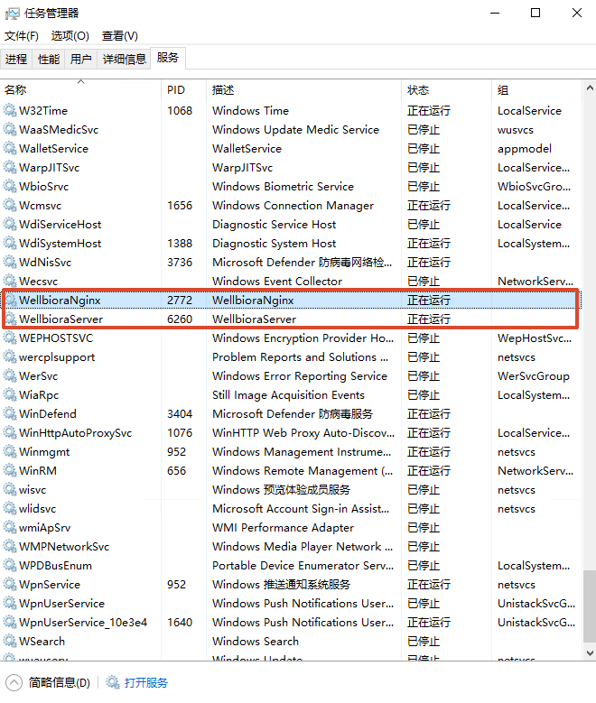
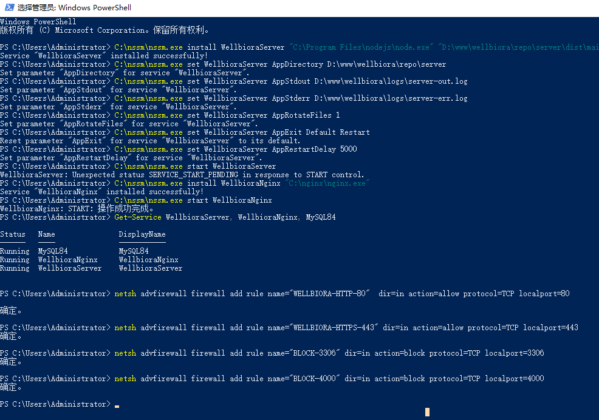

# WELLBIORA H5 商城 · 日常运维命令速查（实测版）

> 对应《WELLBIORA-WindowsServer2019部署指南》**第十七节**，2026-09-07 基于生产实测整理。
> 目标读者：非专业运维（项目负责人本人）。记不住命令很正常——**本文就是用来复制粘贴的，不需要背**。
> 命令均建议在**管理员 PowerShell** 中执行（开始菜单搜 PowerShell → 右键 → 以管理员身份运行）。

---

## 先搞懂一件事：网站是怎么"自己跑着"的

三个核心程序都通过 NSSM 注册成了 **Windows 服务**（第十三节），运行方式与手动开窗口完全不同：

- 由系统直接拉起，跑在看不见的"会话 0"里，**不依赖任何 PowerShell/cmd 窗口**；
- 关窗口、断开远程桌面、注销登录，**都继续跑**；
- **服务器重启后自动启动**，不需要任何人登录去手动运行。

| 服务名 | 是什么 | 监听端口 |
|---|---|---|
| `WellbioraServer` | NestJS 后端（API） | 4000（仅本机） |
| `WellbioraNginx` | Nginx（静态页面 + 反代） | 80 / 443 |
| `MySQL84` | MySQL 数据库 | 3306（仅本机） |

任务管理器「服务」页（或 `services.msc`）可以随时看到它们的运行状态：



```text
Running  WellbioraNginx     ← 网站页面 + HTTPS
Running  WellbioraServer    ← 后端接口
Running  MySQL84            ← 数据库
```



## 一、看状态 / 重启（最高频）

```powershell
# 看三个服务活没活
Get-Service WellbioraServer, WellbioraNginx, MySQL84

# 重启后端（改了 .env、更新后端代码后）
Restart-Service WellbioraServer

# 重启 Nginx（改了 nginx.conf 后）
Restart-Service WellbioraNginx

# 临时停掉 / 再启动（少用）
Stop-Service WellbioraServer
Start-Service WellbioraServer

# 端口监听检查：有输出=在听，没输出=挂了
netstat -ano | findstr ":4000"
```

**图形界面等价操作**：`Win+R` → `services.msc`，找到服务右键 启动/停止/重启，效果与命令完全一样。

> ⚠️ **Nginx 专属坑**：网上常见的 `C:\nginx\nginx.exe -s reload` 在我们的环境**会报错**（`OpenEvent ... Access is denied`），因为 Nginx 是 NSSM 服务。改配置后的标准动作是：先 `.\nginx.exe -t` 验语法，再 `Restart-Service WellbioraNginx`。详见 `deploy/16.HTTPS部署教程.md` 第四步。

## 二、日志排查（出问题第一反应）

```powershell
Get-Content D:\www\wellbiora\logs\server-err.log -Tail 50    # 后端错误，最近50行
Get-Content D:\www\wellbiora\logs\server-out.log -Tail 50    # 后端普通日志
Get-Content C:\nginx\logs\wellbiora.error.log  -Tail 50      # Nginx 错误
Get-Content C:\nginx\logs\wellbiora.access.log -Tail 20      # 谁在访问（IP、路径、状态码）
```

结尾加 `-Wait` 就是"实时滚动"模式（类似电视直播），`Ctrl+C` 退出：

```powershell
Get-Content D:\www\wellbiora\logs\server-err.log -Tail 20 -Wait
```

排查思路：**先看服务状态 → 再看 server-err.log 末尾 → 还不行看 Nginx error.log**。九成问题在前两步就能定位。

## 三、改 Nginx 配置的标准动作（永远是这个顺序）

```powershell
cd C:\nginx
.\nginx.exe -t                      # 1. 语法检查，必须显示 syntax is ok
Restart-Service WellbioraNginx      # 2. 重启服务生效
```

跳过第 1 步直接重启的风险：配置有语法错误时 Nginx 起不来，**整站下线**，得回头翻 error.log。

## 四、防火墙规则（看 / 加 / 删）

```powershell
# 加规则（示例：放行 443）
netsh advfirewall firewall add rule name="WELLBIORA-HTTPS-443" dir=in action=allow protocol=TCP localport=443

# 查看已有规则（列表里按名称找 WELLBIORA- 开头的）
netsh advfirewall firewall show rule name=all | findstr /i "WELLBIORA"

# 删规则
netsh advfirewall firewall delete rule name="WELLBIORA-HTTPS-443"
```

**图形界面等价操作**：`Win+R` → `wf.msc` → 左侧「入站规则」，右键即可删改。

> 现有规则一览：`WELLBIORA-HTTP-80` / `WELLBIORA-HTTPS-443`（放行）、`BLOCK-3306` / `BLOCK-4000`（封死，安全底线，**不要删**）。
> ⚠️ Windows 防火墙 **block 规则优先于 allow**：BLOCK-3306/4000 存续期间，任何针对这两个端口的 allow 都无效。将来真要对外开 MySQL，须先删 BLOCK 再限源 IP 放行（目前无此需求）。
> 云厂商**安全组**是另一道独立的门（阿里云控制台网页操作），两道都要开才行。

## 五、版本更新发布（最常用流程）

后端有改动时：

```powershell
cd D:\www\wellbiora\repo
git pull
cd server
npm ci
npm run build
npm run migration:run          # 有新迁移时执行，没有则自动跳过
Restart-Service WellbioraServer
```

前端 / 管理后台有改动时（静态文件即改即生效，**无需重启任何服务**）：

```powershell
cd D:\www\wellbiora\repo
git pull
cd frontend ; npm ci ; npm run build
Copy-Item dist\* D:\www\wellbiora\site\h5\ -Recurse -Force
cd ..\admin ; npm ci ; npm run build
Copy-Item dist\* D:\www\wellbiora\site\admin\ -Recurse -Force
```

## 六、数据库备份

```powershell
mysqldump -u wellbiora -p --single-transaction wellbiora_shop > D:\www\wellbiora\logs\backup-$(Get-Date -Format "yyyyMMdd").sql
```

每日自动备份的配置方法见部署指南 17.3（任务计划程序，每天 03:00）。备份文件含密文身份证号，**当敏感数据保管**。

## 七、服务崩溃自愈加固（建议做一次）

NSSM 已配置后端崩溃 5 秒自动重启，但建议再给两个服务加上 Windows 层面的恢复策略，双保险：

1. `Win+R` → `services.msc` → 右键 `WellbioraServer` →「属性」→「恢复」选项卡；
2. 「第一次失败」「第二次失败」「后续失败」都选 **「重新启动服务」**；
3. 确定后，对 `WellbioraNginx` 重复一遍。

这样万一服务意外崩溃，系统会自己拉起来，不用半夜远程救火。

## 常见问题速查

| 现象 | 第一反应 | 命令 |
|---|---|---|
| 网站打不开 | 看三个服务状态 | `Get-Service WellbioraServer, WellbioraNginx, MySQL84` |
| 页面开但接口报错 | 看后端错误日志末尾 | `Get-Content D:\www\wellbiora\logs\server-err.log -Tail 50` |
| 接口 502 | 后端没在跑 | `Restart-Service WellbioraServer` |
| 改了 nginx.conf 没生效 / reload 报拒绝访问 | 重启 Nginx 服务 | `Restart-Service WellbioraNginx` |
| 改了 .env 没生效 | 后端要重启才读 | `Restart-Service WellbioraServer` |
| 外网打不开、本机正常 | 防火墙 + 安全组 | `wf.msc` 查规则；阿里云控制台查安全组 |
| 怀疑端口被占 | 查监听 | `netstat -ano | findstr ":4000"` |

---

> 与部署指南的关系：指南第十七节是提纲，本文是展开的命令速查版——增加了解释性内容（服务为何不依赖窗口、block 优先于 allow、reload 的坑、恢复选项加固）和「现象 → 第一反应」速查表。**命令以本文为准，流程细节以指南 17.1~17.4 为准。**
