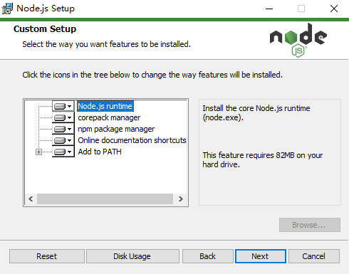
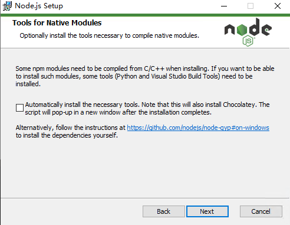
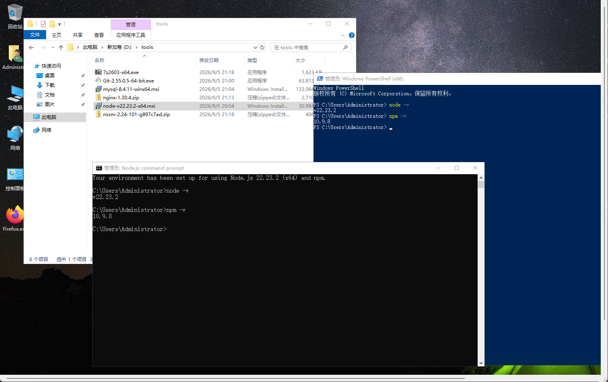

# WELLBIORA H5 商城 · Node.js 安装教程（图解版）

> 适用对象：Windows Server 2019 生产服务器（同样适用于本机 Windows 10/11 开发机）。
> 实测版本：**Node.js v22.23.2（x64 MSI）**，装完自带 **npm 10.9.8**。
> 截图来源：2026-09-05 在服务器上实际安装时逐屏截取，界面与本文一一对应。
> 配套文档：`WELLBIORA-WindowsServer2019部署指南.md`（第四节「安装 Node.js」的简版说明，第十节起部署 frontend / server / admin 都要用到这里的 node 与 npm）。
>
> ⚠️ 一句话结论：**这一版安装向导可以无脑一路 Next**，全程没有任何需要主动改动的选项（与 Git 安装正好相反）。唯一要记住的是「Tools for Native Modules」那一屏**保持不勾**——它默认就是不勾的，别手痒去点。装完必须**关掉所有已打开的命令行窗口重开一个**，否则 PATH 不生效。

---

## 目录

1. [下载与安装前准备](#一下载与安装前准备)
2. [配置速查表（先看这张表）](#二配置速查表先看这张表)
3. [逐屏图解安装过程](#三逐屏图解安装过程)
4. [安装后验证](#四安装后验证)
5. [收尾推荐配置](#五收尾推荐配置)
6. [常见坑与疑问](#六常见坑与疑问)

---

## 一、下载与安装前准备

| 项目 | 说明 |
|---|---|
| 官方下载页 | https://nodejs.org/en/download → 选 **Node.js 22.x LTS** → **Windows Installer (.msi) 64-bit** |
| 文件名 | `node-v22.23.2-x64.msi`（约 30 MB） |
| 版本要求 | **必须是 v22.23.2**。生产与开发环境版本保持一致，避免「本地好的、线上报错」这类隐性差异 |
| 安装体积 | Custom Setup 屏底部提示：默认选择约需 **82 MB** 磁盘空间 |
| 安装位置 | 保持默认 `C:\Program Files\nodejs\`，与 Git / Nginx 一样装系统盘，便于第八节 NSSM 注册服务时写死绝对路径 |
| 自带 npm | 装完即有，本例为 **10.9.8**，**不需要也不建议单独升级 npm** |

⚠️ 服务器上**以管理员身份**运行 MSI（右键 → 以管理员身份运行），否则写不进 `Program Files`、也改不了系统 PATH。

⚠️ 不要用 `zip` 免安装版、不要用 nvm-windows、不要用 winget。理由见部署指南第 4.0 节的对照表，一句话：**生产服务器只用官网 MSI，路径固定、PATH 自动写好**。

---

## 二、配置速查表（先看这张表）

安装向导共 5 屏需要点 Next，**全部保持默认**：

| # | 界面标题 | 我们的选择 | 是否需改默认 | 说明 |
|---|---|---|---|---|
| 1 | License Agreement | 勾 **I accept the terms** → Next | 需点一下 | 不勾无法继续，不算配置项 |
| 2 | Destination Folder | `C:\Program Files\nodejs\` | 默认 | 不改，部署脚本按此路径写死 |
| 3 | Custom Setup | 5 项全部保持默认（含 **Add to PATH**） | 默认 | 详见下方逐项说明 |
| 4 | Tools for Native Modules | **复选框不勾** | 默认（别去勾） | 勾了会连带装 Chocolatey + Python + Visual Studio Build Tools，数 GB |
| 5 | Ready to Install | **Install** → 进度完成 → **Finish** | — | 约 1 分钟 |

### Custom Setup 五项逐个说明

| 组件 | 默认 | 结论 | 作用 |
|---|---|---|---|
| **Node.js runtime** | ✅ | 必留 | 核心运行时 `node.exe` |
| **corepack manager** | ✅ | 保持默认 | 统一管理 yarn / pnpm 的小工具，本项目用不到但留着无副作用 |
| **npm package manager** | ✅ | 必留 | 装依赖全靠它，去掉后 `npm install` 直接没有命令可用 |
| **Online documentation shortcuts** | ✅ | 随意 | 只是开始菜单里的在线文档快捷方式，勾不勾都不影响功能 |
| **Add to PATH** | ✅ | **必留，绝不能去掉** | 把 `C:\Program Files\nodejs\` 写入系统 PATH；去掉后命令行找不到 node，NSSM 注册服务时也得手写绝对路径，徒增排查成本 |

> 底部磁盘占用提示 **82 MB** 是「当前所选功能」的合计体积，属正常值。

---

## 三、逐屏图解安装过程

双击 `node-v22.23.2-x64.msi` → UAC 授权 → 许可协议页勾选接受 → Next → 安装路径页保持默认 → Next，然后进入下面各屏。

### 第 1 屏：Custom Setup（选择组件与 PATH）



**这一屏什么都不用动，五项保持默认，直接 Next。**

右侧描述面板此时选中的是 `Node.js runtime`，显示 "Install the core Node.js runtime (node.exe)." 与 "This feature requires 82MB on your hard drive."，属正常提示。

唯一要确认的是最后一项 **Add to PATH** 前面的图标是「Will be installed on local hard drive」（实心小磁盘图标），不是「This feature will not be installed」。本例截图里五项全部为默认安装状态，符合要求。

### 第 2 屏：Tools for Native Modules（编译工具）



**这一屏的关键：让复选框保持空着（截图里就是不勾的状态），直接 Next。**

页面原文是 "Optionally install the tools necessary to compile native modules." —— 只有当某个 npm 包需要在 Windows 上现场编译 C/C++ 时才用得上这套工具。

**本项目（frontend / server / admin）的依赖全是纯 JS 或自带预编译二进制，不需要现场编译。** 一旦勾上，安装结束后会再弹一个窗口去装 Chocolatey，然后顺着装 Python 和 Visual Studio Build Tools，几个 GB 的下载量，还会往系统里塞额外的后台服务和 PATH 项。生产服务器上这些都属于「不必要的复杂度」，坚决不勾。

### 第 3 屏：Ready to Install

确认无误后点 **Install**，等待进度条走完（约 1 分钟），最后点 **Finish**。此屏无配置项，未截图。

### 第 4 屏：安装完成后的验证环境



装完后开始菜单会出现 **Node.js command prompt**（截图下方那个黑色窗口就是它，标题栏写着 `管理员: Node.js command prompt`，首行提示 "Your environment has been set up for using Node.js 22.23.2 (x64) and npm."）。

用它或任意 PowerShell / CMD 都可以验证，见下一节。截图上方是服务器上 `D:\tools\` 目录，六个安装包（7z、Git、MySQL、Nginx、Node、NSSM）已按部署指南第二节备齐。

---

## 四、安装后验证

⚠️ **先关掉安装前就打开的所有 PowerShell / CMD 窗口，重新开一个**。环境变量只对新开的窗口生效，这是「装完却提示 node 不是内部或外部命令」的头号原因。

新窗口里执行：

```powershell
node -v
npm -v
```

实测输出（与截图一致）：

```
PS C:\Users\Administrator> node -v
v22.23.2
PS C:\Users\Administrator> npm -v
10.9.8
```

判定标准：

| 命令 | 期望输出 | 说明 |
|---|---|---|
| `node -v` | **v22.23.2** | 版本号必须与部署指南要求完全一致 |
| `npm -v` | **10.9.8**（10.x.x 均可） | 该版 Node.js 自带的配套 npm，属正常值 |
| `where node` | `C:\Program Files\nodejs\node.exe` | 可选。确认 PATH 指向的是 MSI 装的那份，不是历史遗留的其它安装 |

三条都对上，Node.js 就绪，可以继续第六节装 MySQL。

---

## 五、收尾推荐配置

服务器在国内网络时，给 npm 配国内镜像，后面 `npm install` 会快很多：

```powershell
npm config set registry https://registry.npmmirror.com
npm config get registry    # 确认输出 https://registry.npmmirror.com/
```

> 这是全局配置，对 frontend / server / admin 三个工程同时生效。若某天某个包在镜像上拉取失败，可临时用 `npm install --registry=https://registry.npmjs.org` 指定官方源，不必改回全局。

---

## 六、常见坑与疑问

**Q1：`node -v` 提示「不是内部或外部命令」或「无法将 node 项识别为 cmdlet」？**
A：按顺序排查——① 关掉所有命令行窗口重开（最常见原因）；② 检查安装时 Add to PATH 是否被取消过，若不确定就重新运行 MSI 选 **Repair**；③ 手动看「系统属性 → 环境变量」里 PATH 是否包含 `C:\Program Files\nodejs\`。

**Q2：服务器上已经有旧版 Node.js 怎么办？**
A：直接运行 v22.23.2 的 MSI 覆盖安装即可（同大版本内覆盖安全）。装完用 `where node` 确认只有一处、且指向 `C:\Program Files\nodejs\`；若发现还有别的路径（如 nvm 目录）抢在 PATH 前面，把那条清理掉。

**Q3：要不要顺手 `npm install -g npm@latest` 升级 npm？**
A：**不要。** 10.9.8 是 Node v22.23.2 官方配套并通过测试的版本，单独升级 npm 容易引入 lockfile 行为差异，生产环境保持「Node 自带什么就用什么」。

**Q4：需要装 PowerShell 7 吗？Server 2019 自带的 shell 够不够？**
A：**够用，不用装。** CMD 从不更新、所有 Windows 都一样；Server 2019 自带的是 Windows PowerShell 5.1（系统内置的最后一版，微软已不再给它加功能），更新的 PowerShell 7 是独立产品、需另行安装。本项目部署全流程（跑 node/npm、注册 NSSM 服务、启停 Nginx、`git pull`）只用最基础的命令行能力，内置 CMD 与 PowerShell 5.1 完全胜任，部署指南里的命令也都是按内置 shell 写的。

**Q5：为什么不勾 Tools for Native Modules，装了会不会以后后悔？**
A：后悔的代价极低——真遇到需要编译原生模块的包，重新运行 MSI 勾上那一项、或者直接单独装 VS Build Tools 就行。反过来，现在装了这几个 GB 的工具链，会长期占着磁盘和开始菜单，还可能被安全扫描当成多余软件报出来。

**Q6：安装路径能改到 D 盘吗？**
A：可以，但不建议。保持 `C:\Program Files\nodejs\` 的好处是：部署指南第八节 NSSM 注册服务时填的可执行路径、以及网上几乎所有教程的路径都能直接对上，排查问题不用先确认「这台机器装哪了」。C 盘空间不是瓶颈时，优先选一致性。

---

*实测记录：2026-09-05 于 Windows Server 2019 生产服务器，Node.js v22.23.2 x64 MSI，`node -v` = v22.23.2，`npm -v` = 10.9.8，全程保持默认选项，未勾选 Tools for Native Modules。*
