# WELLBIORA H5 商城 · Git for Windows 安装教程（图解版）

> 适用对象：Windows Server 2019 生产服务器（同样适用于本机 Windows 10/11 开发机）。
> 实测版本：**Git 2.55.0.5**（安装完成后 `git --version` 输出 `git version 2.55.0.windows.5`）。
> 截图来源：2026-09-05 在服务器上实际安装时逐屏截取，界面与本文一一对应。
> 配套文档：`WELLBIORA-WindowsServer2019部署指南.md`（第五节「安装 Git」的简版说明，第九节「获取项目代码」会用到这里的 git）。
>
> ⚠️ 一句话结论：**这版安装向导不能无脑一路 Next**，有 4 屏需要改动（组件页、默认编辑器、初始分支名、HTTPS 后端），其余保持默认。改错的项事后都能用 `git config` 调回来，不必重装。

---

## 目录

1. [下载与安装前准备](#一下载与安装前准备)
2. [配置速查表（先看这张表）](#二配置速查表先看这张表)
3. [逐屏图解安装过程](#三逐屏图解安装过程)
4. [安装后验证](#四安装后验证)
5. [收尾必做的两项配置](#五收尾必做的两项配置)
6. [常见坑与回退方法](#六常见坑与回退方法)

---

## 一、下载与安装前准备

| 项目 | 说明 |
|---|---|
| 官方下载页 | https://git-scm.com/install/windows → 点 **64-bit Git for Windows Setup** |
| 文件名形如 | `Git-2.55.0.5-64-bit.exe`（约 65 MB） |
| 版本对应关系 | 安装包标题 `2.55.0.5` = 装完后 `git version 2.55.0.windows.5`，最后一段是 Windows 构建号，不是新版本 |
| 安装体积 | 组件页底部提示：默认选择约需 **336.5 MB** 磁盘空间 |
| 安装位置 | 保持默认 `C:\Program Files\Git`，与 Node、Nginx 一样装在系统盘，便于部署脚本写死路径 |

⚠️ 服务器上要**以管理员身份**运行安装包（右键 → 以管理员身份运行），否则写不进 `Program Files`、也改不了 PATH。

---

## 二、配置速查表（先看这张表）

安装向导共 11 屏选择项，按下表操作即可。**「需改」= 默认值不是我们想要的**。

| # | 界面标题 | 我们的选择 | 默认？ | 理由 |
|---|---|---|---|---|
| 1 | Select Components | 保留 Windows Explorer integration、Git LFS、Associate `.git*` files；**取消** `.sh` 关联、Check daily for updates、**Scalar** | 需改 | 服务器不该每天弹更新提示；Scalar 是超大仓库插件，本项目用不到，少一个常驻服务 |
| 2 | Choosing the default editor | **Use Notepad as Git's default editor** | 需改 | 默认 Vim 会把不熟键位的人卡在编辑窗口里退不出来 |
| 3 | Adjusting the name of the initial branch | **Override** + 填 `main` | 需改 | 与远端主分支 `main` 统一，避免本地 master / 远端 main 两套名字 |
| 4 | Adjusting your PATH environment | 第二项 **Git from the command line and also from 3rd-party software** | 默认 | PowerShell / cmd / 脚本都能调用 git，且**不会**用 GNU 的 `find`、`sort` 覆盖 Windows 同名命令 |
| 5 | Choosing the SSH executable | Let Git decide（自带 OpenSSH） | 默认 | 走 HTTPS 拉代码时用不到，保持默认 |
| 6 | Choosing HTTPS transport backend | **Use the OpenSSL library** | 需改 | 用 Git 自带 `ca-bundle.crt` 验证书，不受服务器根证书存储新旧影响；也避开 Secure Channel 强制吊销检查（OCSP/CRL）在国内网络卡住 |
| 7 | Configuring the line ending conversions | 第一项 **Checkout Windows-style, commit Unix-style**（`core.autocrlf=true`） | 默认 | 仓库本就在 Windows 上开发，索引里存 LF；Node/Vue 项目对换行符不敏感 |
| 8 | Choose the default behavior of 'git pull' | **Merge** | 默认 | 服务器只 `pull` 不本地提交时三种选项等价，Merge 行为最不容易让人困惑 |
| 9 | Choose a credential helper | **Git Credential Manager** | 默认 | 记住 GitHub 访问令牌，免每次输密码 |
| 10 | Configuring the terminal emulator | **Use MinTTY** | 默认 | Git Bash 的中文输入、快捷键体验更好 |
| 11 | Configuring extra options | 勾 **Enable file system caching**；**不勾** Enable symbolic links | 默认 | 软链接需要 `SeCreateSymbolicLink` 权限，本项目结构用不到 |

> 版本差异提醒：Git for Windows 2.55 已经**没有**旧版的「Choose the default behavior of `git push`」那一屏（push 固定为 simple），取而代之的是第 8 屏的 `git pull` 行为选择。网上老教程里让选 "Simple" 的步骤可以忽略。

---

## 三、逐屏图解安装过程

双击安装包 → UAC 授权 → 欢迎页（Welcome to Git）直接 **Next** → 选择安装路径保持 `C:\Program Files\Git` **Next**，然后进入下面各屏。

### 第 1 屏：Select Components（选择组件）

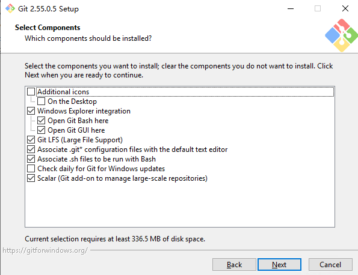

这一屏保持勾选：

- **Windows Explorer integration**（含子项 Open Git Bash here / Open Git GUI here）—— 右键能直接「在此处打开 Git Bash」，服务器上排查问题很方便。
- **Git LFS (Large File Support)** —— 当前仓库没用到 LFS，但装上无副作用，以后遇到大文件素材不用再重装。
- **Associate `.git*` configuration files with the default text editor** —— 双击 `.gitignore` 能用记事本打开。

这一屏取消勾选（截图里是勾着的，需要点掉）：

- **Associate `.sh` files to be run with Bash** —— 服务器不靠双击执行 shell 脚本，取消更干净。
- **Check daily for Git for Windows updates** —— 生产环境的版本升级必须手动可控，和 Node / Nginx / MySQL 的管控思路一致。⚠️ 如果是装在自己的开发机上，这条留着勾无所谓。
- **Scalar (Git add-on to manage large-scale repositories)** —— 为百万级文件仓库做的后台抓取/稀疏检出插件，本项目体量完全用不到。

Additional icons / On the Desktop 保持不勾。

### 第 2 屏：Choosing the default editor used by Git（默认编辑器）

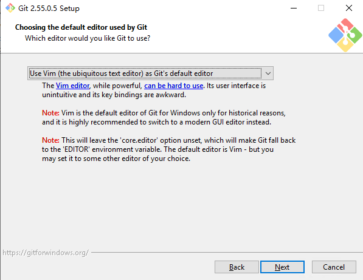

下拉框出厂停在 **Use Vim**，改成 **Use Notepad as Git's default editor**：

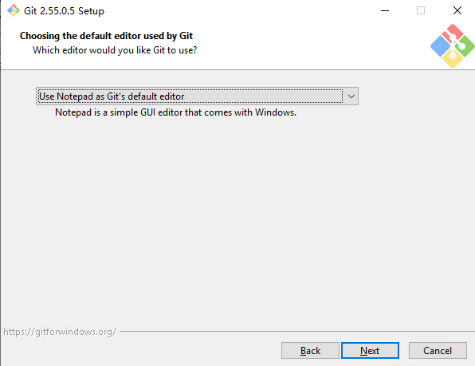

改它的意义 —— 这几个场景 Git 会弹出编辑器窗口，Vim 的 `i` / `Esc` / `:wq` 会直接把人卡住：

- `git commit` 不带 `-m`（在编辑器里写提交说明）
- `git tag -a` 打附注标签、`git merge` 生成合并说明
- `git rebase -i` 交互式变基、`git config -e` 编辑配置

服务器上没有 VS Code / Sublime，列表里实际可选的就是 Vim 和记事本。日常如果都用 `git commit -m "..."`，其实一辈子碰不到编辑器，选 Notepad 只是「万一碰到时不至于被卡住」。

### 第 3 屏：Adjusting the name of the initial branch（新仓库初始分支名）

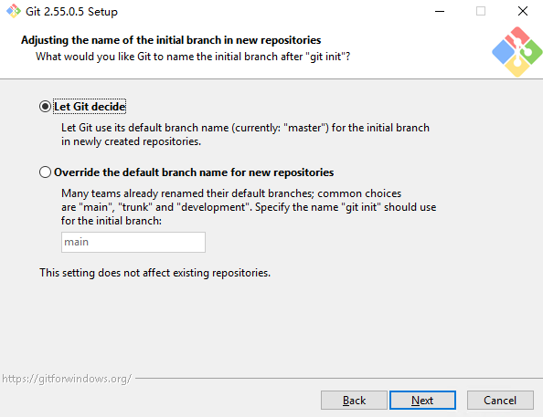

默认选中的 **Let Git decide** 会给出 `master`。改选第二项 **Override the default branch name for new repositories**，输入框保持 `main`。

- 本项目（`work-h5-wellbiora-shop`）主分支就是 `main`，GitHub 新建仓库默认也是 `main`。让本地 `git init` 也生成 `main`，就不会出现推送时要写 `-u origin master:main` 的别扭情况。
- 页面最后一行写了 **This setting does not affect existing repositories** —— 它只写入全局配置 `init.defaultBranch=main`，已存在的仓库分支名不会被改动，零风险。

### 第 4 屏：Adjusting your PATH environment（PATH 配置）

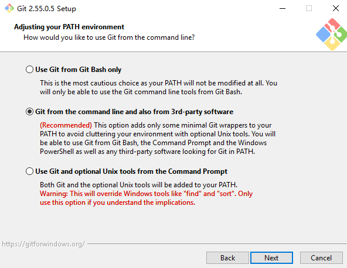

**保持默认的第二项**：Git from the command line and also from 3rd-party software。

- 它只往 PATH 加几个最小化的 Git 包装器，不污染系统环境；cmd、PowerShell、第三方程序（Node 工具链、部署脚本、IDE）都能找到 `git`。
- ⚠️ 不要选第三项 **Use Git and optional Unix tools from the Command Prompt**：它会把 Git 自带的 `find.exe`、`sort.exe` 排到 Windows 同名工具前面。Windows 的 `find` 和 GNU 的 `find` 参数完全不同，一旦覆盖，系统上依赖原生 `find` 的脚本会静默出错（页面红字 Warning 说的就是这个）。
- 也不要选第一项 **Use Git from Git Bash only**：那样 PowerShell 里直接敲 `git` 会提示找不到命令，后面部署脚本没法用。

### 第 5 屏：Choosing the SSH executable

保持默认 **Let Git decide**（使用 Git 自带的 OpenSSH），直接 Next。（本教程未截图，此屏无改动。）

### 第 6 屏：Choosing HTTPS transport backend（HTTPS 用哪套 SSL/TLS 库）

出厂默认停在第二项 Secure Channel：

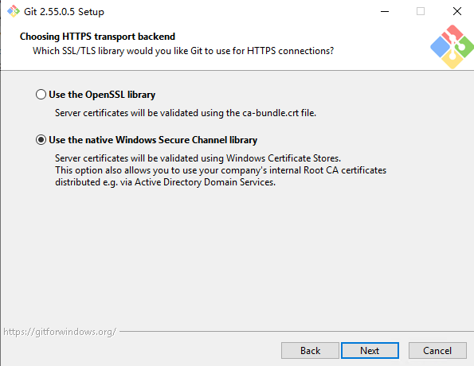

改选第一项 **Use the OpenSSL library**：

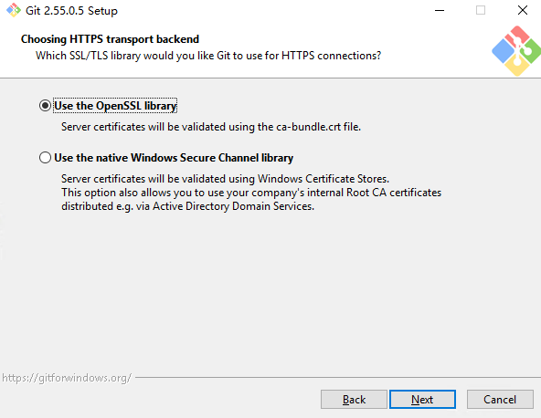

- **为什么选 OpenSSL**：服务器访问的是公网 GitHub。OpenSSL 用 Git 自带的 `ca-bundle.crt` 根证书包，随 Git 版本一起更新，不依赖 Windows 根证书存储是否打全补丁（Server 2019 若 Windows Update 不及时，根证书偏旧会报 `server certificate verification failed`）。另外 Secure Channel 默认要做证书吊销检查（CRL/OCSP），国内网络里这类请求常被卡住，表现为 `git clone/fetch` 莫名挂起或报 schannel 错误。
- **什么时候才该选 Secure Channel**：公司内网有 SSL 拦截/审计网关，或使用企业自建 CA 签发的证书（需要读 Windows 证书存储 / AD 分发的根证书）。公网云服务器 + GitHub 不属于这种情况，所以页面上那句 "your company's internal Root CA" 的好处用不上。
- 选错也不是大事，见[第六节回退方法](#六常见坑与回退方法)。

### 第 7 屏：Configuring the line ending conversions（换行符处理）

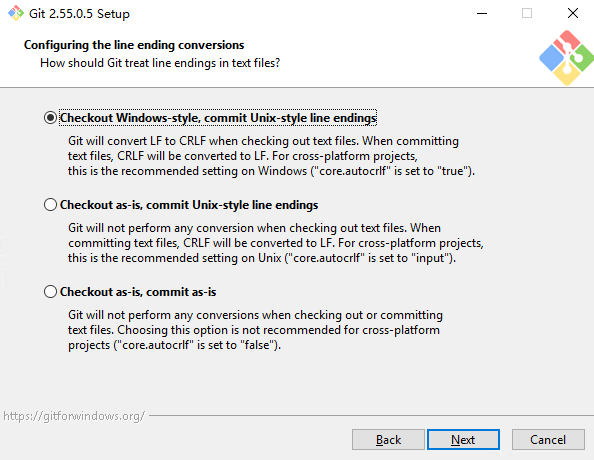

**保持默认第一项**：Checkout Windows-style, commit Unix-style line endings（即 `core.autocrlf=true`）—— 检出时 LF→CRLF，提交时 CRLF→LF。

本仓库最初就是在 Windows 上开发的，仓库内存的是 LF，服务器这样配置与现状一致；Node/Vue 项目对换行符不敏感，不必纠结。以后 `git status` 偶尔提示 "LF will be replaced by CRLF" 是正常说明，不是错误。

（第二项 `input` 是 Unix 开发者的跨平台选择，第三项 `false` 明确不推荐，本页红字也写了。）

### 第 8 屏：Choose the default behavior of 'git pull'

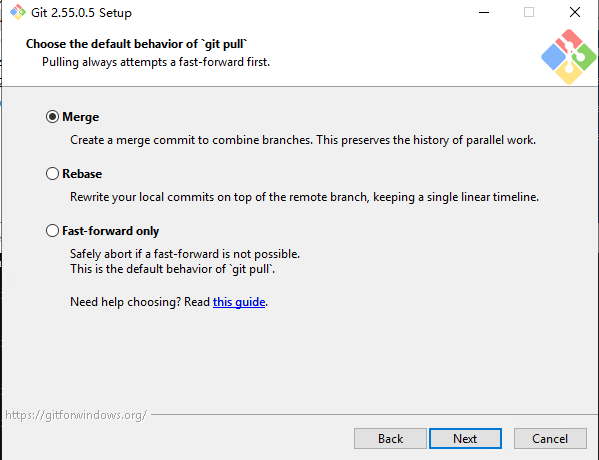

**保持默认 Merge**，直接 Next。

- 服务器上的仓库正常只有 `clone` + `pull`，本地不产生提交，远端总是领先 —— 这种情况下三种选项表现完全一样（都是快进）。
- 只有「本地与远端分叉」时才有区别：Merge 补一个合并提交；Rebase 把本地提交挪到远端之后；Fast-forward only 直接报 `Not possible to fast-forward, aborting.` 停下来让你人工处理。对服务器来说 Merge 是最不容易让人困惑的行为。
- 真遇到想强制快进的那一次，不必回来改设置，命令带参数即可：`git pull --ff-only`。

### 第 9 屏：Choose a credential helper（凭据助手）

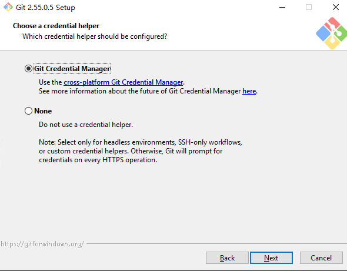

**保持默认 Git Credential Manager**，直接 Next。

它负责第一次通过 HTTPS 访问 GitHub 时弹窗收集令牌，之后存进 Windows「凭据管理器」，后续 `clone` / `pull` / `push` 不再反复要密码。页面上对 **None** 的说明写得很清楚：只有无人值守（headless）、只用 SSH、或你另有凭据方案时才选 None —— 通过远程桌面操作的 Windows 服务器能弹窗，不属于这几种情况。

⚠️ GitHub 已不支持账号密码，弹窗时要粘 **Personal Access Token**：classic 令牌勾 `repo` 权限，或 fine-grained 令牌给对应仓库的读写权限。私有仓库必须用令牌，公开仓库只读 `clone` 可以完全不涉及。

### 第 10 屏：Configuring the terminal emulator to use with Git Bash

保持默认 **Use MinTTY (the default terminal of MSYS2)**，直接 Next。（本教程未截图，此屏无改动。选第二项 Windows 默认控制台是为了能用 winpty 跑交互式程序，本项目用不到。）

### 第 11 屏：Configuring extra options（额外选项）

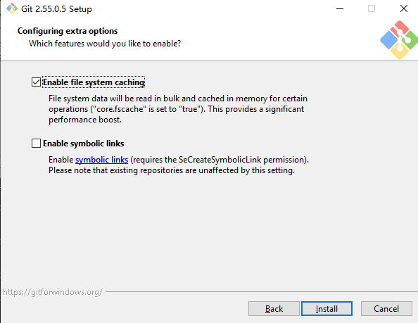

这一屏的默认状态**正好是推荐配置，直接点 Install**：

- **Enable file system caching ✅ 保持勾选** —— 对应 `core.fscache=true`，批量读取文件系统元数据并缓存，对 `git status` 这类要扫大量文件的操作提速明显，安全无副作用。
- **Enable symbolic links ☐ 保持不勾** —— 勾了需要 `SeCreateSymbolicLink` 权限（要么开 Windows 开发者模式，要么以管理员身份跑 git），否则反而会在检出软链接时报权限错误。本项目 `frontend` / `server` / `admin` 都是普通目录，无 monorepo workspace 软链，用不到。

### 第 12 屏：安装与完成

点 Install 后是进度条。中间可能蹦出一两页纯搞笑的**彩蛋页**（例如 "Adjusting your day of the week"、"Blowing dust from the monitor"），这些页面没有任何实际作用，一路 Next / Finish 点过去即可。最后一页的 **Launch Git Bash** 勾不勾随意。

---

## 四、安装后验证

### 4.1 基础检查（版本与配置）

⚠️ **必须重开一个 PowerShell 窗口**，旧窗口读不到刚写入的 PATH。

```powershell
git --version          # 期望：git version 2.55.0.windows.5
where.exe git          # 期望：C:\Program Files\Git\cmd\git.exe
git config --global -l # 检查这几项是否符合预期
```

`git config --global -l` 里应该能看到（键名顺序无所谓）：

| 配置项 | 期望值 | 来自哪一屏 |
|---|---|---|
| `init.defaultbranch` | `main` | 第 3 屏 Override |
| `core.autocrlf` | `true` | 第 7 屏第一项 |
| `core.fscache` | `true` | 第 11 屏勾选 |
| `credential.helper` | `manager` / `selector manager` | 第 9 屏 GCM |
| `core.editor` | 记事本相关值 | 第 2 屏 Notepad |

再做一次真实连通性验证（这一步会触发 GCM 弹窗输 PAT，正好确认证书 + 凭据链路全通）：

```powershell
git ls-remote https://github.com/somewindows/work-h5-wellbiora-shop.git
```

能列出各分支和对应 commit 哈希，说明 PATH、OpenSSL 后端、证书校验、凭据助手全部正常。

> ℹ️ 本项目服务器采用 **SSH** 方式连接 GitHub（免令牌、不会被弹窗卡住，适合脚本自动 `pull`），上面的 HTTPS 验证可跳过，直接看 4.2～4.4。

### 4.2 首次连 GitHub：主机密钥指纹提示怎么办

第一次用 SSH 连 GitHub（不管是 `git ls-remote git@github.com:...` 还是 `ssh -T git@github.com`），一定会弹这个：

```
The authenticity of host 'github.com (20.205.243.166)' can't be established.
ED25519 key fingerprint is SHA256:+DiY3wvvV6TuJJhbpZisF/zLDA0zPMSvHdkr4UvCOqU
Are you sure you want to continue connecting (yes/no/[fingerprint])?
```

这不是报错，是 SSH 在问你「对面这台真的是 github.com 吗，还是有人在中间冒充」。它把服务器的密钥指纹念给你，由你人工核对。

核对方法：对照 GitHub 官方公布的指纹（官方文档页 *GitHub's SSH key fingerprints*，以官方页面为准）：

| 算法 | GitHub 官方公布指纹 |
|---|---|
| **ED25519** | `SHA256:+DiY3wvvV6TuJJhbpZisF/zLDA0zPMSvHdkr4UvCOqU` |
| ECDSA | `SHA256:p2QAMXNIC1TJYWeIOttrVc98/R1BUFWu3/LiyKgUfQM` |
| RSA | `SHA256:uNiVztksCsDhcc0u9e8BujQXVUpKZIDTMczCvj3tD2s` |

提示里是 ED25519，与上表第一行一致 → **输入 `yes` 回车**（⚠️ 别用 `no`，`no` 只是本次断开、不做记录，下次还会问）。

放行后会发生两件事：

1. github.com 的密钥被写进 `known_hosts`（Git Bash 和 Windows 自带 OpenSSH 共用同一个文件：`C:\Users\<用户名>\.ssh\known_hosts`），以后不再询问。
2. 紧接着大概率报这个：

```
git@github.com: Permission denied (publickey).
fatal: Could not read from remote repository.
```

⚠️ **这是预期的正常结果，不是 git 装坏了**。它说明网络通、主机信任已建立，只差「你是谁」的密钥 —— 见 4.3。

（另外：走 SSH 时，第 6 屏的 OpenSSL 后端和第 9 屏的 Git Credential Manager 都**不参与**，那两项只管 HTTPS 通道。）

### 4.3 生成部署密钥（Deploy Key）

在 Git Bash 里执行（`-C` 后面是备注，写清是哪台机器，方便以后在 GitHub 后台辨认）：

```bash
ssh-keygen -t ed25519 -C "wellbiora-prod-server" -f ~/.ssh/wellbiora_deploy
```

- 提示 `Enter passphrase` 时**直接回车两次**（不设口令）。无人值守的服务器一旦设了口令，每次 `git pull` 都要人输，脚本就没法自动化了。
- ⚠️ 私钥 `~/.ssh/wellbiora_deploy`（**没有** `.pub` 后缀那个）**绝不外传、绝不提交进仓库**；要贴到 GitHub 的只有 `.pub` 公钥。

打印公钥并复制全部内容（以 `ssh-ed25519` 开头，一整行不能断）：

```bash
cat ~/.ssh/wellbiora_deploy.pub
```

到 GitHub 添加：

- **推荐（单仓库只读）**：仓库页 → **Settings** → **Deploy keys** → **Add deploy key**，Title 填机器名，Key 粘公钥，**不要勾** `Allow write access`。服务器只用来拉代码，给写权限没必要，也更安全。
- 若这台机器要访问你账号下多个仓库：改加到个人头像 → Settings → **SSH and GPG keys**（注意这种密钥有全部仓库的读写权限，泄露影响面大）。

告诉 SSH「连 github.com 就用这把密钥」——编辑 `~/.ssh/config`（没有就新建，注意文件名无后缀）：

```
Host github.com
  HostName github.com
  User git
  IdentityFile ~/.ssh/wellbiora_deploy
  IdentitiesOnly yes
```

### 4.4 验证 SSH 连通，并把仓库地址换成 SSH

```bash
ssh -T git@github.com
git ls-remote git@github.com:somewindows/work-h5-wellbiora-shop.git
```

- `ssh -T` 成功时输出 `Hi somewindows! You've successfully authenticated...`；⚠️ 如果显示的是 **`Hi somewindows/work-h5-wellbiora-shop!`**（问候语是「所有者/仓库名」而不是用户名），说明生效的是该仓库的 **Deploy key** —— 这正是我们要的效果，同样算成功。两种输出都代表认证通过。
- ⚠️ SSH 地址是**冒号**形式 `git@github.com:用户名/仓库.git`，不是斜杠；写成 `github.com/用户名/仓库.git`（不带协议头）会被当成本地路径，报 `does not appear to be a git repository`。

拉代码 / 换地址：

```bash
# 首次克隆
cd /d/www/wellbiora/repo
# ⚠️ 结尾的 "." 表示克隆进当前目录，让 repo\ 本身就是仓库根（与部署指南第九节一致）；要求 repo\ 是空目录
git clone git@github.com:somewindows/work-h5-wellbiora-shop.git .

# 已经用 HTTPS 克隆过了，改走 SSH
cd work-h5-wellbiora-shop
git remote -v
git remote set-url origin git@github.com:somewindows/work-h5-wellbiora-shop.git
git remote -v
git pull
```

Deploy key 没给写权限时，`git push` 会报 `Permission denied (publickey)` 或提示 deploy key 无写权限 —— 这是预期行为，服务器上本来也不该 push。

**兜底：22 端口不通时改走 443**。国内服务器访问 GitHub 偶尔 22 端口被干扰（表现为 `ssh: connect to host github.com port 22: Connection timed out`），把 `~/.ssh/config` 里那段改成走 SSH-over-HTTPS 端口即可：

```
Host github.com
  HostName ssh.github.com
  User git
  Port 443
  IdentityFile ~/.ssh/wellbiora_deploy
  IdentitiesOnly yes
```

---

## 五、收尾必做的两项配置

### 5.1 提交身份（只要涉及 commit 就必须设）

```powershell
git config --global user.name  "somewindows"
git config --global user.email "你提交时用的邮箱"
```

服务器上如果只做 `clone` / `pull`，不设也不影响拉代码；但只要有 commit 或 `git pull --rebase`，缺身份会直接报错。

### 5.2 首次拉取项目代码

按部署指南第九节执行（服务器已配好 Deploy key，走 SSH）：

```bash
cd /d/www/wellbiora/repo
# ⚠️ 结尾的 "." 表示克隆进当前目录，让 repo\ 本身就是仓库根（与部署指南第九节一致）；要求 repo\ 是空目录
git clone git@github.com:somewindows/work-h5-wellbiora-shop.git .
```

若某天改用 HTTPS 地址拉取：私有仓库会触发 GCM 弹窗，用户名填 GitHub 账号、密码位置粘 PAT。

**克隆成功的判断标准**（2026-09-05 服务器实测）：

```
Cloning into '.'...
remote: Enumerating objects: 1377, done.
Receiving objects: 100% (1377/1377), 74.03 MiB | 5.62 MiB/s, done.
Resolving deltas: 100% (553/553), done.
```

- 末尾两行都是 **`100%`** 即成功（仓库约 74 MB，大头是产品图片素材）；进度条残影（如 `Resolving deltas: 29%`）可以无视。
- 克隆完验证：

```bash
cd /d/www/wellbiora/repo
git log --oneline -3   # 最新一条应显示 3c30285 (HEAD -> main, origin/main)，与远端 main 一致
ls                     # frontend、server、admin、docs、prototype 直接平铺在 repo\ 下 = "." 克隆生效，无嵌套子目录
```

- `ls` 看不到 `.git`、`.gitignore` 是因为它们是隐藏项（`ls -a` 才显示），属正常。

---

## 六、常见坑与回退方法

| 现象 / 需求 | 处理 |
|---|---|
| 装完敲 `git` 提示「不是内部或外部命令」 | 重开 PowerShell；仍不行则说明第 4 屏选成了第一项，重新运行安装包改选第二项 |
| 想换 HTTPS 后端（第 6 屏选错了） | 不用重装：`git config --global http.sslBackend winhttp`（切回 Secure Channel）或 `openssl` |
| 克隆时报 `server certificate verification failed` | 确认走的是 OpenSSL 后端；再确认系统时间正确（证书校验对时间敏感，服务器时间漂移是常见原因） |
| 脚本 / 计划任务里跑 git 被 GCM 弹窗卡住 | 临时禁用交互：`git -c credential.interactive=never pull`；长期方案是改用 SSH 部署密钥（见 4.3，服务器只读拉代码时更省心） |
| SSH 连 GitHub 弹 `Are you sure you want to continue connecting (yes/no/...)` | 按 4.2 核对 ED25519 指纹一致后输 `yes`，属正常的首次信任确认 |
| `git@github.com: Permission denied (publickey).` | 网络与主机信任都没问题，缺的是密钥：按 4.3 生成并把公钥加成 Deploy key，再确认 `~/.ssh/config` 的 `IdentityFile` 指向了正确私钥 |
| `ssh: connect to host github.com port 22: Connection timed out` | 22 端口不通，按 4.4 末尾把 `~/.ssh/config` 改成 `HostName ssh.github.com` + `Port 443` |
| `git pull` 报 `Not possible to fast-forward, aborting.` | 说明服务器上有人手工改过代码。要么 `git pull --rebase` 把本地改动挪到后面，要么 `git checkout -- .` 丢弃本地改动（⚠️ 丢弃前先确认服务器上没有唯一副本的配置/日志） |
| 被卡在 Vim 界面退不出来 | 按 `Esc`，输入 `:q` 再按回车。或按本文第 2 屏改成 Notepad |
| 想看/改某一项全局配置 | `git config --global --edit`（会用第 2 屏选的编辑器打开 `C:\Users\<你>\.gitconfig`） |
| 误勾了 Enable symbolic links | 无害，只是检出软链接时才需要权限；想关掉执行 `git config --global core.symlinks false` |

> 与部署指南第五节的关系：那份指南写的是「一路默认 Next」的极简版，其中「Vim 保持默认也行」与本文不同 —— 两者都不影响部署结果，本文的 Notepad 只是防卡手的稳妥选择。**以本文第二节的速查表为准。**
