# WELLBIORA H5 商城 · MySQL 8.4 安装教程（图解版）

> 适用对象：Windows Server 2019 生产服务器（同样适用于本机 Windows 10/11 开发机）。
> 实测版本：**MySQL Community Server 8.4.11 LTS**（MSI 安装包 `mysql-8.4.11-winx64.msi`，约 130 MB）。
> 截图来源：2026-09-06 在服务器上实际安装时逐屏截取，界面与本文一一对应。
> 配套文档：`WELLBIORA-WindowsServer2019部署指南.md`（第六节「安装 MySQL 8.4」的简版说明，第十节建表冒烟测试依赖本教程装好的数据库）。
>
> ⚠️ 一句话结论：整个安装分**两个窗口**——先是 MSI 安装器（约 3 屏），装完自动弹出 **MySQL Configurator** 配置向导（8 屏）。真正要动手的地方共 5 处：① 缺 VC++ 运行库时手动补装；② Setup Type 选 Typical；③ Configurator 里 Config Type 选 Server Computer、**取消防火墙端口勾选**；④ 设 root 强密码；⑤ Apply Configuration 点 Execute。其余全部保持默认 Next。
>
> 🔑 提前说一条密码约定（贯穿全程）：root 密码和后面建的 `wellbiora` 账号密码，都建议 16 位以上、大小写+数字+符号混合，且符号只用 `! @ % ^ * ( ) - _ = +` 这类——**避开 `# $ 反引号 " ' \ 空格`**，因为这些字符在 `.env` 配置文件和 PowerShell 里容易被错误解析，后端连数据库的密码就写在 `.env` 里。

---

## 目录

1. [下载与安装前准备](#一下载与安装前准备)
2. [配置速查表（先看这张表）](#二配置速查表先看这张表)
3. [逐屏图解：MSI 安装器](#三逐屏图解msi-安装器)
4. [逐屏图解：MySQL Configurator](#四逐屏图解mysql-configurator)
5. [安装后验证与建库建账号](#五安装后验证与建库建账号)
6. [常见坑与处理](#六常见坑与处理)

---

## 一、下载与安装前准备

| 项目 | 说明 |
|---|---|
| 官方下载页 | https://dev.mysql.com/downloads/mysql/ → 版本选 **8.4.11 LTS** → 系统 **Windows (x86, 64-bit)** → **MSI Installer** |
| 文件名形如 | `mysql-8.4.11-winx64.msi`（约 130 MB） |
| ⚠️ 下载页陷阱 | 不要走 https://dev.mysql.com/downloads/installer/ ——那是「统一安装器 MySQL Installer」，**只更新到 8.0 就停止维护了**（页面有官方 Note 说明），下不到 8.4。必须去上面的 Server 产品页下载 |
| 前置依赖 | **Microsoft Visual C++ 2019 Redistributable**（x64）——MySQL 官方用 VS2019 编译，缺它安装器直接拒绝运行，见[第三节插曲](#插曲缺少-vc-2019-运行库报错弹窗) |
| 安装位置 | 程序默认 `C:\Program Files\MySQL\MySQL Server 8.4\`，数据目录默认 `C:\ProgramData\MySQL\MySQL Server 8.4\`，均保持默认 |
| 安装产物 | 一个名为 **MySQL84** 的 Windows 服务（开机自启）——所以 MySQL 不需要 NSSM，指南第七节的 NSSM 只管 Node 和 Nginx |

⚠️ 服务器上全程用**管理员身份**操作（安装和后面的 PATH 修改都需要管理员 PowerShell）。

---

## 二、配置速查表（先看这张表）

### MSI 安装器（3 屏）

| # | 界面标题 | 我们的操作 | 默认？ | 理由 |
|---|---|---|---|---|
| 1 | Choose Setup Type | **Typical** | 需选 | 8.4 独立安装包本身就只含数据库服务器，Typical 即等价于旧版安装器的「Server only」；没有 Workbench 等额外工具可装 |
| 2 | Ready to install MySQL Server 8.4 | 点 **Install** | 需点 | 8.4.11 实测没有「Check Requirements」屏，环境检查在启动时自动完成 |
| 3 | Completed the MySQL Server Setup Wizard | 点 **Finish**（保持勾选 Run MySQL Configurator） | 默认 | 勾着才会自动弹出配置向导 |

### MySQL Configurator（8 屏）

| # | 界面标题 | 我们的操作 | 默认？ | 理由 |
|---|---|---|---|---|
| 1 | Welcome | Next | 默认 | — |
| 2 | Data Directory | 保持 `C:\ProgramData\MySQL\MySQL Server 8.4\` | 默认 | 小型商城数据量很小，放系统盘即可，不必现在增加迁移复杂度 |
| 3 | Type and Networking | Config Type 改 **Server Computer**；端口 3306 不动；**取消勾选 Open Windows Firewall ports for network access** | 需改 | 服务器上还跑 Node/Nginx，不能让 MySQL 独占全部内存（Dedicated Machine 才会独占）；防火墙端口只开放给需要对外服务的程序，MySQL 只被本机后端访问（127.0.0.1），不开端口更安全。**这是全程最容易漏的一处** |
| 4 | Accounts and Roles | 设置 **root 强密码**（两遍输入一致） | 需改（必填） | 数据库超级管理员密码，没有默认值；务必抄进密码本，丢了只能走重置流程 |
| 5 | Windows Service | 服务名 `MySQL84`、开机自启 ✅、Standard System Account | 默认 | 与指南中 `Get-Service MySQL84` 验证命令一致 |
| 6 | Server File Permissions | 选第一项（数据目录只授权服务账户+管理员组） | 默认 | 本身就是最安全的选择 |
| 7 | Sample Databases | Sakila / World 两个示例库都**不勾** | 默认 | 官方教学用的假数据，生产不需要 |
| 8 | Apply Configuration | 点 **Execute**，等 8 个步骤全部绿勾 → Next → Finish | 需点 | 全绿才算配置生效（含初始化数据库、启动服务） |

> 版本差异提醒：网上老教程（基于 8.0 统一安装器）里的「Server only」「Check Requirements」「Authentication Method（选 Caching SHA2）」「Standalone MySQL Server」等步骤/选项，在 8.4 独立 MSI + Configurator 中**已不存在**——认证方式默认就是 Caching SHA-2，不需要单独选。别按老教程找不存在的屏。

---

## 三、逐屏图解：MSI 安装器

### 插曲：缺少 VC++ 2019 运行库报错弹窗

双击 `mysql-8.4.11-winx64.msi` 后，服务器上实测第一件事是弹这个窗：

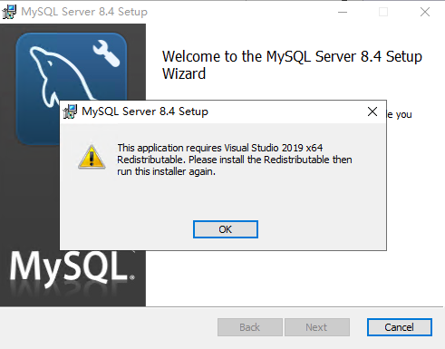

> This application requires Visual Studio 2019 x64 Redistributable. Please install the Redistributable then run this installer again.

**处理步骤**（注意这个弹窗只有 OK 按钮，安装器界面并没有提供下载入口）：

1. 点 **OK**，安装器退出；
2. 下载并安装微软官方 VC++ 运行库（约 25 MB）：

   ```
   https://aka.ms/vs/17/release/vc_redist.x64.exe
   ```

   `aka.ms` 是微软官方短链；这是 2015–2022 合并版运行库，向下兼容，完全满足「2019」的要求。双击 → 勾同意条款 → Install，一两分钟装完；
3. **重新双击** MySQL 的 msi，这次就能正常进入向导了。

### 第 1 屏：Choose Setup Type（选择安装类型）

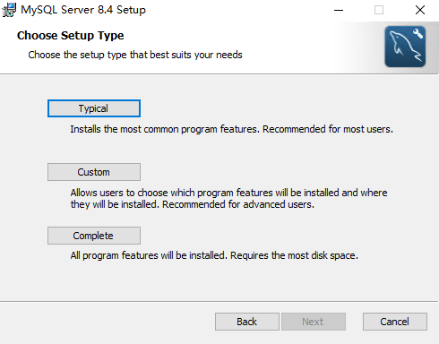

三个选项的实际区别：

- **Typical** ✅ —— 安装核心服务器程序，默认装到 `C:\Program Files\MySQL\MySQL Server 8.4\`，正是我们要的；
- Custom —— 只有想改安装目录才用，没必要；
- Complete —— 和 Typical 实际内容几乎一样，只多几个文档快捷方式。

旧版安装器这屏叫「Server only」，8.4 独立包里没有这个选项——因为包里本来就只有服务器，**Typical 就是它**。点 Typical → **Next**。

### 第 2 屏：Ready to install MySQL Server 8.4

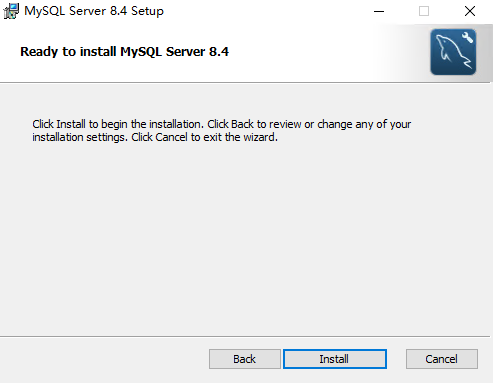

点 **Install**，进度条十几秒到一分钟跑完（复制文件阶段）。

### 第 3 屏：Completed the MySQL Server Setup Wizard

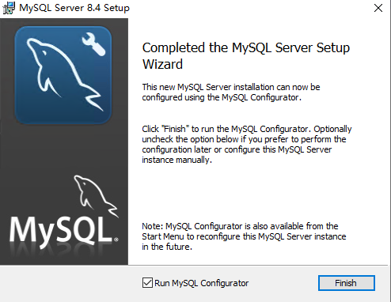

**确认底部「Run MySQL Configurator」保持勾选（默认已勾），点 Finish。** 随后自动弹出 MySQL Configurator 配置向导——真正的选项都在下一个窗口里，到这里别关。

---

## 四、逐屏图解：MySQL Configurator

窗口标题变成「MySQL Configurator」，左侧是完整路线图。**8 屏里只有 3 屏要动手**（第 3、4、8 屏），其余一路 Next。

### 第 1 屏：Welcome

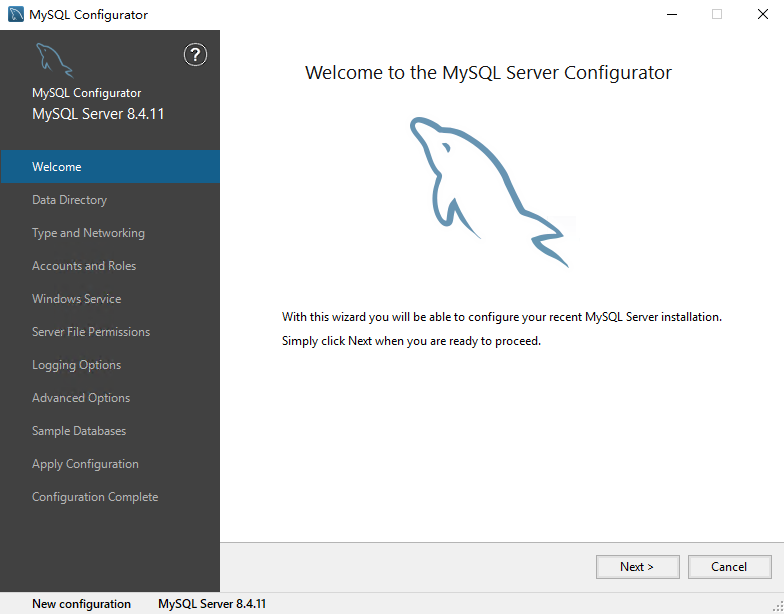

直接 **Next**。左侧从上到下即配置顺序：Data Directory → Type and Networking → Accounts and Roles → Windows Service → Server File Permissions → Sample Databases → Apply Configuration。

### 第 2 屏：Data Directory（数据目录）

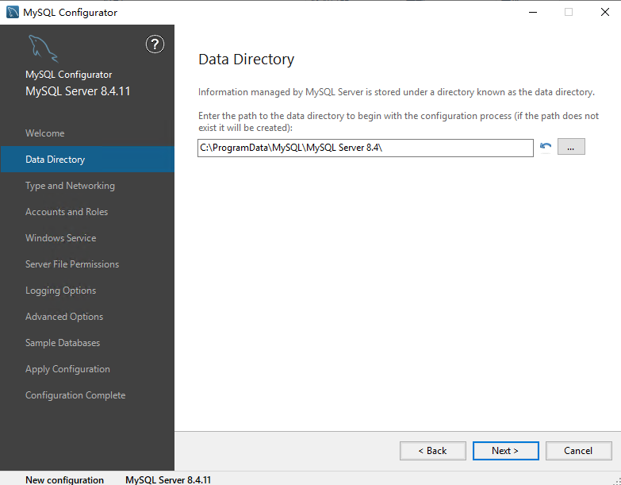

保持默认 `C:\ProgramData\MySQL\MySQL Server 8.4\`，**Next**。（数据放系统盘没问题：本项目是小型商城，数据量很小，以后真需要迁移再考虑，不必现在增加复杂度。）

### 第 3 屏：Type and Networking（⚠️ 本教程最重要的一屏）

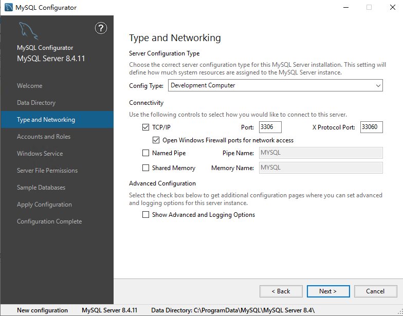

这屏要做**两个动作**：

1. **Config Type 改成「Server Computer」**（下拉框默认停在 Development Computer）。三个选项只决定 MySQL「能吃多少内存」：
   - Development Computer —— 给开发机用，吃得最少；
   - **Server Computer** ✅ —— 适合「服务器上还有别的应用」的场景，咱们这台机器还跑 Node 后端和 Nginx，选它；
   - Dedicated Machine —— 整机只跑 MySQL、独占全部内存，本项目不适用。
2. **取消勾选「Open Windows Firewall ports for network access」**（TCP/IP 下面那个复选框，截图里是勾着的，要点掉）。MySQL 只被本机的后端程序访问（127.0.0.1），完全不需要向局域网/公网开防火墙端口，开着反而多一个攻击面。

**其余全部不动**：TCP/IP 保持勾选、端口 3306、X Protocol 33060、Named Pipe / Shared Memory 保持不勾、底部「Show Advanced and Logging Options」**不勾**（勾了会多出 Logging / Advanced 两屏，默认日志配置已经够用）。

改完的状态：TCP/IP ✅、防火墙那行 ❌ → **Next**。

### 第 4 屏：Accounts and Roles（⚠️ 设 root 密码）

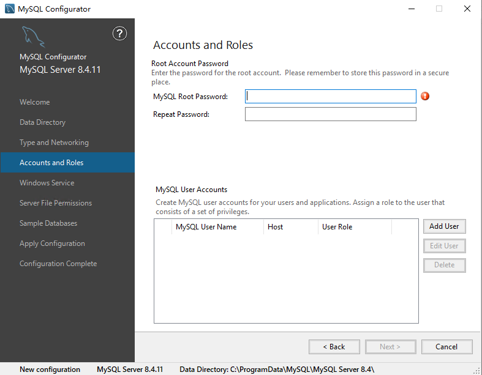

只干一件事：**MySQL Root Password 和 Repeat Password 输入两遍一致的强密码**（16 位以上、大小写+数字+符号，符号按本文开头的约定选）。右侧红色感叹号在两框一致后消失。**设完立刻抄进密码本**——这是数据库超级管理员密码，丢了只能走重置流程。

下方「MySQL User Accounts」区域**不要点 Add User**：项目专用账号 `wellbiora` 在第五节用 SQL 创建，权限可以控制得更精确。输入完 → **Next**。

### 第 5 屏：Windows Service（Windows 服务）

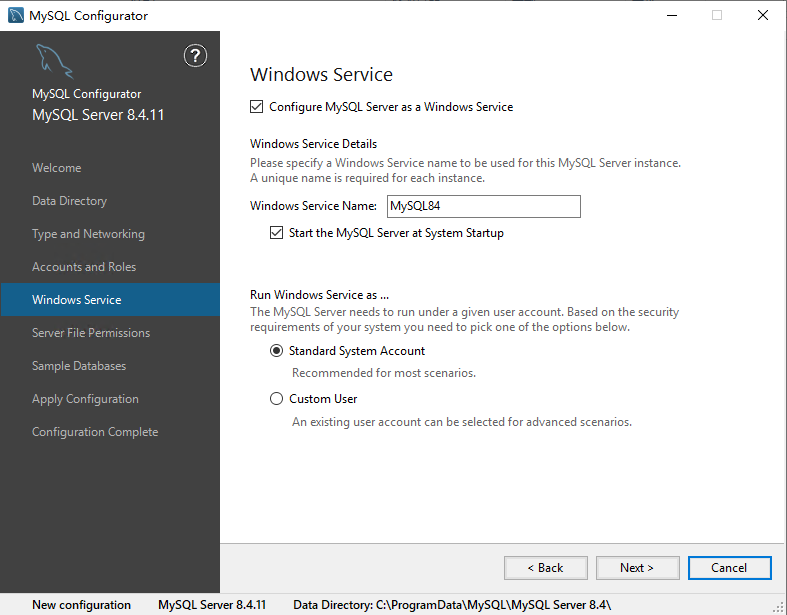

这屏**全部就是我们要的默认值，一个都不用改**：

- ✅ Configure MySQL Server as a Windows Service —— 注册成系统服务（所以 MySQL 不需要 NSSM）；
- 服务名 **MySQL84** —— 与指南里 `Get-Service MySQL84` 验证命令一致；
- ✅ Start the MySQL Server at System Startup —— 开机自启；
- ● Standard System Account —— 默认服务账户即可。

直接 **Next**。

### 第 6 屏：Server File Permissions（文件权限）

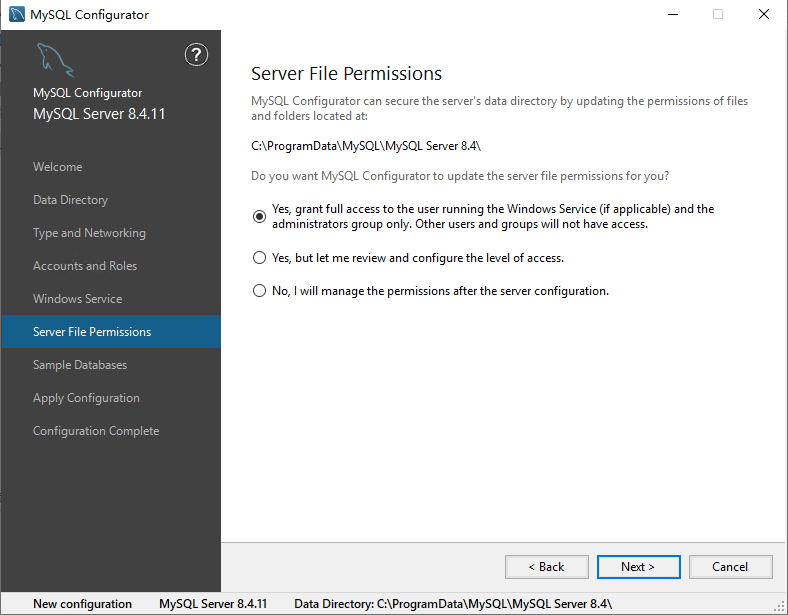

保持默认第一项：**Yes, grant full access to the user running the Windows Service and the administrators group only**——只给「运行服务的账户 + 管理员组」授权，其他用户和组都进不了数据目录，本身就是最安全的选择。**Next**。

### 第 7 屏：Sample Databases（示例数据库）

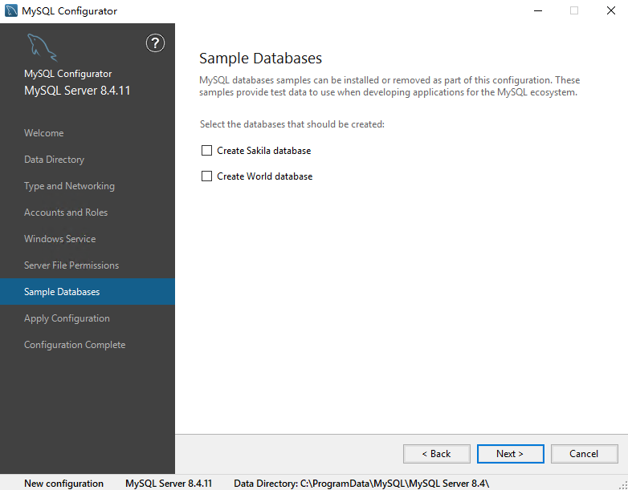

Sakila / World 是官方教学用的假数据库，**两个都不勾**，直接 **Next**。

### 第 8 屏：Apply Configuration（⚠️ 点 Execute）

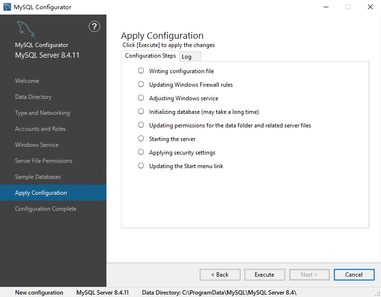

点 **Execute**，8 个步骤依次执行（圆圈 → 绿勾）：

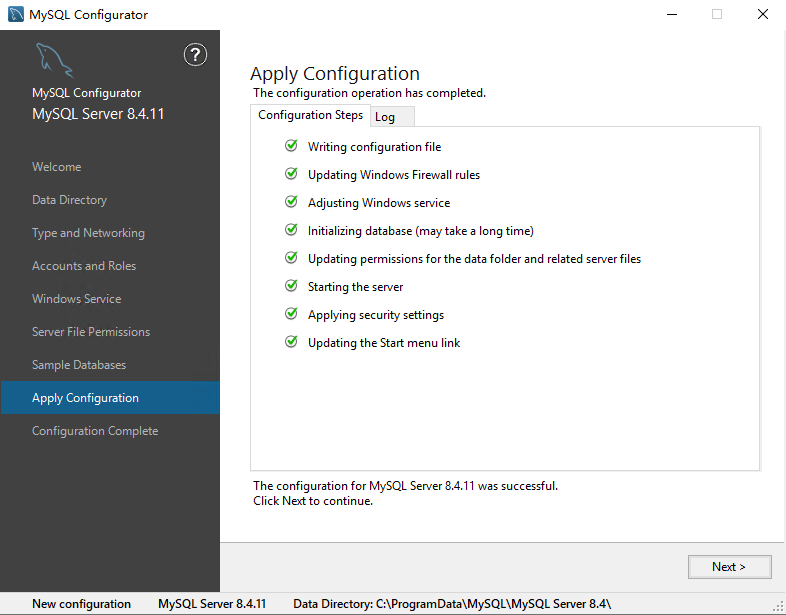

预期现象：

- 「Initializing database」那步可能停十几秒到几十秒，**正常**，别关窗口；
- 「Updating Windows Firewall rules」依然会出现——因为我们取消了勾选，它执行的是「不开端口」；
- 全部 8 行绿勾 ✅、底部出现「The configuration for MySQL Server 8.4.11 was successful」→ **Next**。

任何一行出现**红叉**时不要关窗口，切到旁边的 **Log** 标签页截图排查。

### 终屏：Configuration Complete

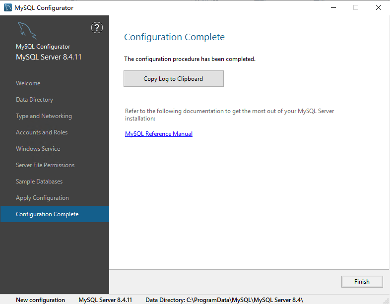

点 **Finish**，安装与配置全部结束。

---

## 五、安装后验证与建库建账号

以下命令都在**管理员 PowerShell** 里执行。

### 5.1 确认服务在跑 + 加入 PATH

```powershell
Get-Service MySQL84
```

预期输出 `Status = Running`。

```powershell
[Environment]::SetEnvironmentVariable("Path", $env:Path + ";C:\Program Files\MySQL\MySQL Server 8.4\bin", "Machine")
```

把 mysql 命令加入系统 PATH。⚠️ 执行完必须**关掉 PowerShell 重开一个**才生效（当前窗口的 PATH 还是旧的）。

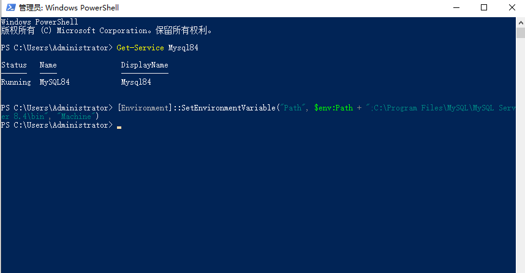

### 5.2 root 登录测试

重开的 PowerShell 里：

```powershell
mysql -u root -p
```

提示 `Enter password:` 时输入 root 密码——**输入时屏幕不显示任何字符是正常的**，输完直接回车。看到 `mysql>` 提示符、`Server version: 8.4.11` 即成功：

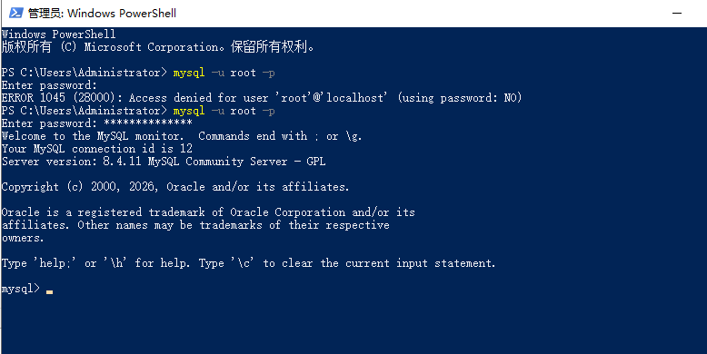

> 截图里第一行的 `ERROR 1045 ... (using password: NO)` 是第一次直接空密码回车导致的无害报错，第二次输入正确密码即进入，不影响任何数据。

### 5.3 建库建账号（指南 6.4，不要让后端直接用 root）

在 `mysql>` 提示符下整段粘贴执行（**先把 `'换成你的强密码'` 换成给 wellbiora 账号设的密码，与 root 不同，两端单引号保留**）：

```sql
CREATE DATABASE wellbiora_shop CHARACTER SET utf8mb4 COLLATE utf8mb4_unicode_ci;

CREATE USER 'wellbiora'@'localhost' IDENTIFIED BY '换成你的强密码';

GRANT SELECT, INSERT, UPDATE, DELETE, CREATE, ALTER, DROP, INDEX, REFERENCES ON wellbiora_shop.* TO 'wellbiora'@'localhost';
FLUSH PRIVILEGES;

SHOW DATABASES;
SHOW GRANTS FOR 'wellbiora'@'localhost';
```

逐句含义：

1. 建库，字符集必须是 **utf8mb4**（支持中文和 emoji）；
2. 建专用账号，只允许本机 `localhost` 登录；
3. 精确授权——只给 `wellbiora_shop` 这一个库的业务所需权限（含 CREATE/ALTER/DROP，因为第十节跑 `npm run migration:run` 建表要用），对其他库一律无权；
4. `SHOW DATABASES` 结果里应能看到 **wellbiora_shop**；`SHOW GRANTS` 应有两行，其中 `GRANT USAGE ON *.*` 表示「授权范围之外啥都不能碰」，配合下一行正是最小权限的效果。

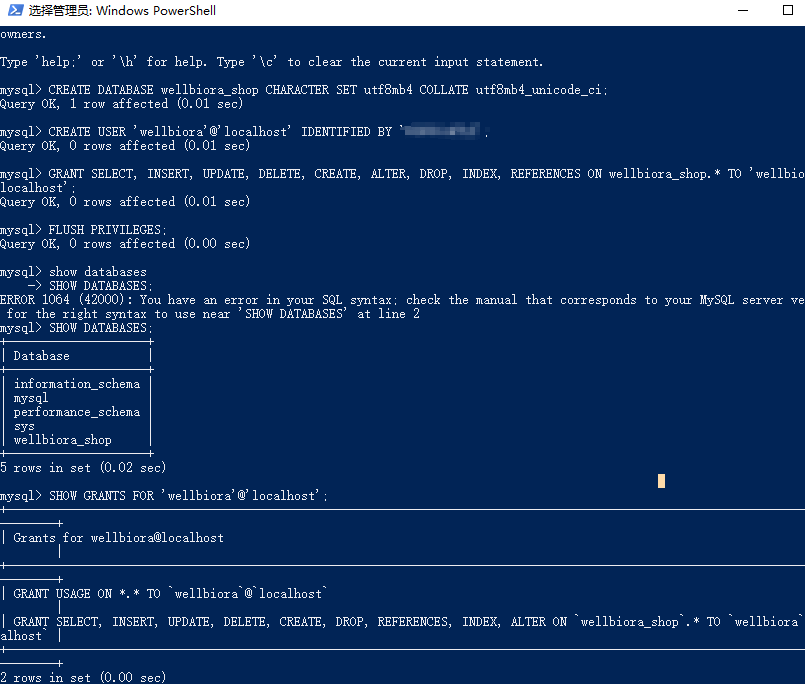

然后 `EXIT;` 退出 root，**用新账号做最终登录验证**：

```powershell
mysql -u wellbiora -p wellbiora_shop
```

能进 `mysql>` 即说明库、账号、密码、权限四样全通：

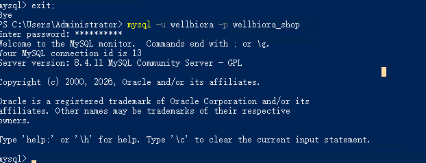

此后 root 密码只在运维时手工使用；后端 `.env` 里填的是 **wellbiora 账号**的密码（指南第十节 10.2）。

---

## 六、常见坑与处理

| 现象 | 原因 | 处理 |
|---|---|---|
| 双击 msi 弹「requires Visual Studio 2019 x64 Redistributable」 | 缺 VC++ 运行库（弹窗只有 OK 按钮，无下载入口） | 见[第三节插曲](#插曲缺少-vc-2019-运行库报错弹窗)：手装 https://aka.ms/vs/17/release/vc_redist.x64.exe 后重跑 msi |
| `mysql` 报「无法将…识别为 cmdlet」 | PATH 命令执行后没重开 PowerShell | 关掉重开管理员 PowerShell 再试；仍不行用 `dir "C:\Program Files\MySQL"` 确认实际目录名后重新执行 5.1 的 PATH 命令 |
| `ERROR 1045 ... (using password: NO)` | 提示输密码时直接空密码回车了 | 重新 `mysql -u root -p`，输入密码（不回显是正常的） |
| `ERROR 1045 ... (using password: YES)` | 密码敲错 | 核对密码本重输；root 密码真丢了需走官方重置流程（停服务 → `mysqld --skip-grant-tables` 改密 → 重启），操作前先备份 `C:\ProgramData\MySQL` 下的数据目录 |
| 粘贴 SQL 报 `ERROR 1064 ... near 'SHOW DATABASES' at line 2` | 把带 `mysql> ` 提示符的文字一起粘进去了 | 无害：报错那条作废，重新输入干净语句即可，已执行的语句不受影响 |
| 忘了取消防火墙勾选，装完后想改 | 想关掉 3306 对外端口 | 开始菜单搜「Windows Defender 防火墙」→ 高级设置 → 入站规则，删除名为 MySQL 的 3306 规则即可；无需重装 |
| 想改 Config Type / 端口等配置 | 装完发现选错 | 开始菜单搜「MySQL Configurator」可重新配置，不必重装；改完它会自动重启服务 |

---

*教程完 · 2026-09-06 实测整理 · 截图 18 张存于 `deploy/images/mysql-install/`*
