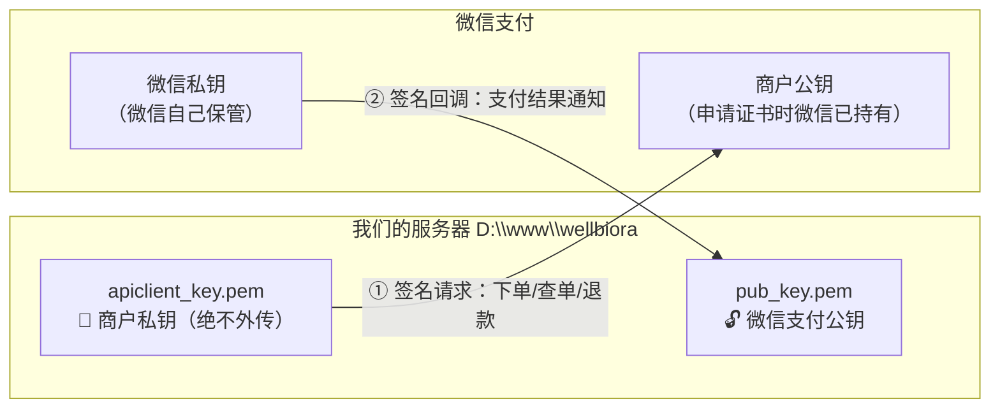
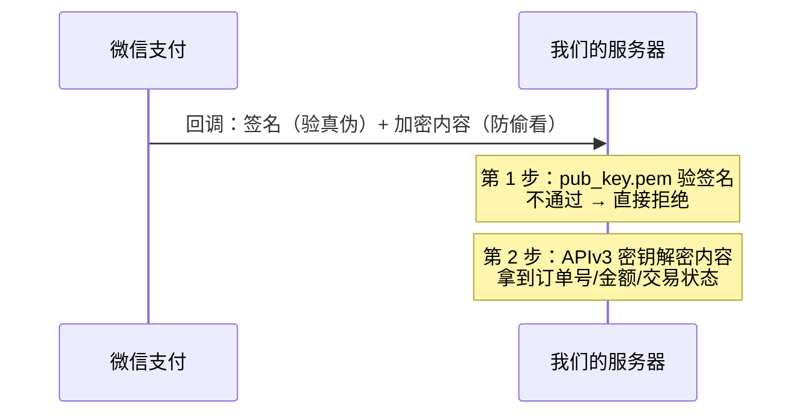

# 微信支付密钥体系扫盲：为什么这么多公钥私钥？

> 写给非技术同事的 5 分钟教程。看完能回答：这些 .pem 文件都是什么、为什么不能少、出问题时是哪把钥匙的事。
> 背景事件：2026-09-11~12 支付回调联调（支付成功但订单不转状态），排查过程见 `docs/tasks/TODO.md` T12。

## 一句话总结

微信支付里有**两对钥匙，各管一个方向**：

- 你发给微信的请求 → 用**你的私钥**签名，微信用**你的公钥**验（证明"我是这个商户"）
- 微信发给你的回调 → 微信用**它的私钥**签名，你用**微信的公钥**验（证明"消息真是微信发的"）

**方向相反，所以钥匙不能混用。** 就像你家门的钥匙只能锁你自己家的门，开不了快递员家的门。

## 服务器上 3 个 .pem 文件对照表

位置：`D:\www\wellbiora\certs\wechatpay\`

| 文件 | 谁的 | 干什么用 | 泄露后果 |
|---|---|---|---|
| `apiclient_key.pem` | **我们的私钥** | 调微信 API 时签名（下单、退款、查单都靠它） | ⚠️ 最严重：别人能冒充我们退款、下单，需立刻去商户平台作废换证 |
| `apiclient_cert.pem` | **我们的证书** | 私钥的"配对证书"，含公钥和商户信息，2031-09 到期 | 低：公钥本来就是公开的 |
| `pub_key.pem` | **微信的公钥** | 验微信回调的签名 | 无：公钥人人可下载 |

## 那 APIv3 密钥又是干什么的？

签名只能防伪，**不加密**。回调里的支付详情（订单号、金额、交易单号）微信是用一把**对称密钥**（APIv3 密钥，32 字节字符串）加了密的，我们要用同一把密钥解开才能读到内容。

所以一次回调要用到**两样东西**：微信公钥（验签）+ APIv3 密钥（解密）。缺一不可。

还有一把 `APIv2 密钥`：老版接口（我们用在海关报关）的 MD5 签名密钥，和上面这套 V3 体系无关，暂时没配。

## 为什么别人要"下载平台证书"，我们只要一个公钥 ID？

微信验签材料有**新旧两种模式**，商户号开通时间决定用哪种：

| | 平台证书模式（旧） | 微信支付公钥模式（新，我们） |
|---|---|---|
| 验签材料 | 微信平台证书，**多张并存、定期轮换** | 一把公钥，**长期有效** |
| 获取方式 | 调 API `GET /v3/certificates` 动态下载 | 商户平台手动下载一次 `pub_key.pem` |
| 回调带的标识 | 证书序列号（可能是好几张之一） | 公钥 ID（**只有一个**，正常！） |
| 维护成本 | 要处理证书轮换、缓存刷新 | 基本不用管 |

我们是新商户号，微信只给了公钥模式——调 `/v3/certificates` 会直接报错"无可用的平台证书"。**这是规定动作，不是故障。** 公钥 ID 只有一个也是正常的，将来微信真换公钥，商户平台才会出现第二个。

## 实战 FAQ（这次联调踩的坑）

**Q：为什么支付能成功、回调却一直失败？**
A：下单和回调走的是不同接口，校验严格度不同。我们的坑是 Node 的 fetch 自动加了个 `Accept-Language: *` 请求头，下单接口不校验这个头所以能过，但拉证书的接口校验，于是一直报错——表现为"支付成功但订单不转状态"。

**Q：回调失败会怎样？钱丢了吗？**
A：不会。微信会按 15s/30s/3m/10m/30m/30m/1h/2h/6h… 的节奏重推，最长 24 小时。期间我们在后台用「查单补状态」按钮主动查单也能把订单状态补上。

**Q：私钥文件能放 git 仓库 / 发微信群吗？**
A：绝对不能。`apiclient_key.pem` 和 APIv3 密钥只在服务器的 `.env` 和 certs 目录里，仓库已 gitignore，前端代码里绝不出现。

**Q：怎么快速判断回调链路通不通？**
A：下一笔 0.01 测试单，**不点补单**，看订单是否自动从"待付款"转"待发货"。自动转了 = 验签解密全链路通畅。
