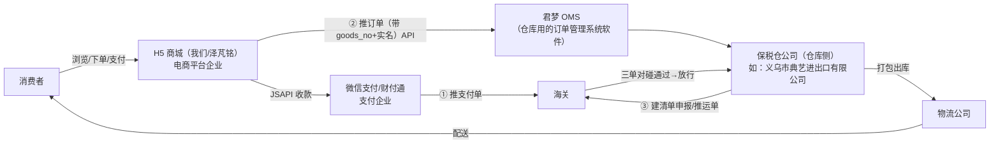
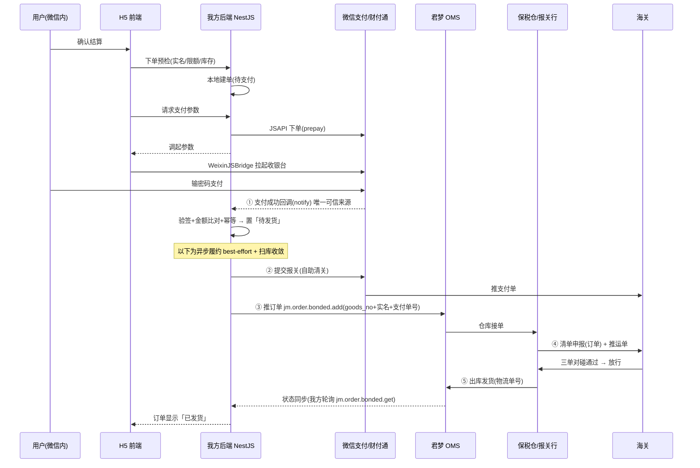
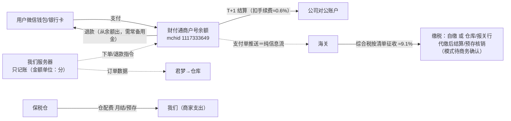

# 跨境进口全链路角色地图：H5、保税仓、君梦各是谁、各干什么

> 写给项目负责人的全局认知教程：作为 H5 开发方（电商平台企业），整条跨境链路里每个角色是谁、边界在哪、我要对接什么。
> 背景事件：2026-09-16 支付单申报 EXCEPT（179 数据抓取平台未对接）+ 2026-09-19 与保税仓签承诺书时的角色梳理。
> 本篇是**迭代式文档**，每轮会话讨论后更新，见文末「迭代记录」。

## 一句话总结

**我们负责"卖"（店铺 + 收钱 + 记真实订单数据），保税仓负责"存和报"（存货 + 报关 + 发货），君梦是仓库用的订单系统软件（数据管道），海关在终点做"三单对碰"自动核对。**

## 角色地图

## 每个角色是谁、和我们什么关系

| 角色 | 是谁 | 干什么 | 和我们的关系 |
|---|---|---|---|
| H5 商城 | 泽芃铭（我们） | 商品展示、收款、收集实名/地址、限额校验、推订单数据 | 自建系统 |
| 微信支付（财付通） | 持牌支付机构 | 收款退款；**推支付单给海关**（自助清关接口） | 商户号合同 + API |
| 君梦 | OMS **软件服务商**，不是仓库 | 我们推订单的 API 入口；仓库在它的系统里接单、回传状态 | OpenAPI 对接（appId/appSecret） |
| 保税仓公司 | 海关特殊监管区内的**仓储运营企业**（仓库侧） | 存货、入出库、**向海关做清单申报**、打包发货、商品海关备案代办 | **商业合同**（仓储委托 + 承诺书） |
| 海关 | 监管方 | 商品备案、清单审核、三单对碰、征收综合税 | 无合同，通过单一窗口/报关行打交道 |
| 物流公司 | 快递 | 干线+末端配送；推运单 | 仓库统一对接，我们基本不碰 |

**关键澄清 1：仓库侧 = 保税仓公司 = 签合作合同的公司。** 义乌典艺这类公司就是仓库侧主体，它同时往往自带报关行能力（或合作报关行），所以"商品海关备案、清单申报"实际都是它操办，但**以泽芃铭的名义**（我们是电商企业/收发货人备案主体）。

**关键澄清 2：君梦只是仓库用的系统。** 不碰货、**不是报关责任主体**——申报清单署名担责的是保税仓/报关行；但清单中的订单数据报文（金二格式）由君梦生成传输，**数据经过它、责任不在它**。不收我们的税。换仓库 = 换君梦账号参数或换一套 OMS 适配（这就是 `docs/tech/oms-adapter.md` 适配层存在的意义）。

## goods_no 是怎么产生的

**goods_no = 仓库在其系统（君梦 OMS）里给商品建档案时分配的"仓库内部商品编码"。它是建档这个人为动作产生的编号，不是"货进仓"物理动作自动生成的。** 完整生命周期：

1. 与保税仓公司签合作协议（含《承诺书》等准入文件）；
2. 向仓库商务提交商品资料（品名/品牌/成分/规格/图片）；
3. 仓库侧在君梦 OMS **建商品档案 → goods_no 诞生**；
4. 商品海关备案（报关行以泽芃铭名义办，仓库代办）；
5. 货运入保税仓（入库挂在已建档案下，形成可售库存）；
6. H5 上架卖货，下单推君梦时传 goods_no，仓库据此拣货申报。

> 注：项目文档记录的君梦客服口径为「备案 → 备货入仓 → OMS 建商品档案」，建档案与入仓的精确先后以仓库商务书面答复为准；不变的是——goods_no 来自建档环节，H5 侧只维护「商城 SKU ↔ goods_no」映射，不要把它当前台商品 ID 用。

## 《承诺书》怎么读（仓库准入文件，2026-09-19 收到）

抬头为义乌市典艺进出口有限公司（仓库侧）。四条承诺的责任全部落在甲方（电商企业 = 我们）：

| 条款 | 白话 | 对我们的实际影响 |
|---|---|---|
| 1 质量安全/商标责任 | 卖的货有问题、商标侵权，我们兜底 | 选品和文案合规红线（AGENTS.md 硬性规则 3）的源头之一 |
| 2 如实申报 | 申报信息造假被罚，我们担责 | H5 收集的实名/订单数据必须真实，不做假单 |
| 3 消费者权益/召回 | 退换货、召回我们负责 | 售后政策（当前只能人工处理）的兜底义务 |
| **4 TOC 实时向海关传输交易数据 + 申报责任；促销价低于海关备案价须先申请** | **就是 179 数据抓取平台对接义务**；打折不能低于备案价 | ①印证 179 责任主体 = 泽芃铭（可委托代办）；②运营定价规则：促销前对照备案价 |

## 我们的 H5 到底负责什么（四件事）

1. **卖相**：标题、详情内容块、价格、图片、上下架——海关和仓库不关心这些（申报用备案名 + goods_no）。
2. **收钱**：微信支付收款/退款，钱进泽芃铭商户号。
3. **收集申报要素**：实名（姓名+身份证）、收货地址、订单金额、单笔≤5000/年度≤26000 限额校验——三单对碰里"订单单"的原始数据只有平台能提供。
4. **传数据**：支付成功后把「goods_no + 实名 + 支付单号 + 金额」推给君梦；支付单由财付通推、运单由仓库推，我们只推订单这一单。

## 三单对碰：谁都不用"申请"

三单对碰是海关收到三张单后的**自动比对**（订购人/支付人/收货人一致性），不是要开通的功能。三张单各推各的：

- **支付单**：财付通推（我们调微信自助清关接口触发）——已通，卡 179 前置。
- **订单单**：数据我们出，经君梦随清单申报给海关。
- **运单**：仓库/物流推。

当前共同前置 = **179 数据抓取平台对接**（责任主体泽芃铭，可委托保税仓/报关行代办，推进中）。

## 一笔订单的完整时序（第 2 轮）

> 代码模块名均已对照 `server/src/` 实际文件核实（2026-09-19）。

### 时序总览

### 分段明细（谁 → 谁，对应哪个模块）

| 段 | 发生了什么 | 涉及方 | 我方代码模块 | 当前状态 |
|---|---|---|---|---|
| 0 前置 | 手机验证码登录 + 微信静默授权绑 openid（JSAPI 必需） | 用户↔我方↔微信 | `auth/`、`wechat-oauth.service.ts` | 真实已通 |
| 1 建单 | 预检（实名/单笔5000/年度26000/库存）→ **仅本地库**建"待支付"单 | 我方内部 | `order.controller/service.ts` | 真实已通 |
| 2 拉起支付 | 微信统一下单拿 prepay_id → 前端调起收银台 | 我方→微信 | `wechat-payment.adapter.ts`、`wechat-pay.client.ts`、前端 `useWechatPay.ts` | 真实已通 |
| 3 支付回调 | 验签+时间窗+金额比对+幂等 → 置"待发货" | 微信→我方 | `payment-notify.controller.ts` | 真实已验收 |
| 4a 推支付单 | 自助清关申报，财付通→海关 | 我方→微信→海关 | `wechat-customs.service.ts` | 提交已通，**EXCEPT 卡 179 对接** |
| 4b 推订单 | 带 goods_no+实名+支付单号推君梦，仓库接单 | 我方→君梦→仓库 | `warehouse.adapter.ts`（适配层） | **本地 mock**（`local-warehouse.adapter.ts`），等君梦参数 |
| 5 申报放行 | 仓库建清单申报+运单，海关三单对碰、放行 | 仓库↔海关 | 无（不经过我们代码） | 等 4a/4b 打通 |
| 5 发货回传 | 出库、物流单号回传，我方轮询收敛状态 | 仓库→君梦→我方 | `order-fulfillment.job.ts` 扫库 + 后台「同步仓储状态」 | mock 可跑；发货回调 method 名待确认 |
| 6 兜底 | 30 分钟未付关单；履约失败重试+后台人工重推；报关状态查询 | 我方内部 | `order-expiry.job.ts`、`order-fulfillment.job.ts`、admin 按钮 | 已通 |
| 7 售后 | 取消：仅申报前可自助（`jm.order.bonded.cancel`），申报后线下；退款：微信原路退 | 我方↔微信↔仓库 | `refund.service.ts`、`refund-settle.job.ts` | 退款真实链路已验收（¥0.01 三秒到账） |

### 三条关键设计认知

1. **支付先行、履约解耦（R10）**：第 3 段落库即算支付成功，第 4 段推仓/报关是 best-effort 异步——外部挂了不阻塞用户、不重复推、不丢单，靠扫库收敛 + 后台人工重推兜底。H5 后端的职责边界 = 第 0~4 段；第 5 段起货和申报都不在我们手里，我们只做"状态收敛 + 展示"。
2. **三单各走各的路，我们的代码只碰订单单**：支付单=财付通推（我们调接口触发）、订单单=我们出数据经君梦、运单=仓库推。三单在海关系统自动对碰，无需申请。
3. **可取消窗口由申报时点决定**：未申报 → API 直接取消；已申报 → 只能仓库线下作废。前端"取消订单"按钮的开放条件、后台退款流程设计都锚定这条。

## 钱和税的流转（第 3 轮）

> 详细出处：`docs/tech/payment-and-funds.md`（单点事实源）。本节是全局视角拼图 + 实操规则。

### 核心心智模型

**钱和信息是两条永不相交的线。** 海关不碰消费资金，仓库不碰用户付的钱；钱只有入口（微信商户号）和出口（对公账户 + 你付给仓库/报关行的两笔钱）。**我们的服务器不是钱库，是记账员 + 传令兵**——库里存的全是"分"为单位的账本数字，真钱一分不经过服务器。

### 四条线

| 线 | 方向 | 内容 | 我们代码的参与 |
|---|---|---|---|
| 1 消费者资金 | 进 | 用户 → 商户号余额 → T+1 对公账户；费率≈0.6%、T+1（以签约为准） | 下单（制造应收）+ 退款（下达支出指令），钱不经过服务器 |
| 2 综合税 | 出 | 纳税人=电商企业（泽芃铭）；保健品 ≈9.1%（关税0 + 增值税13%×70%，以海关核定为准）；页面承诺"税费商家承担"→**含税定价** | 无（定价/商务问题，非代码） |
| 3 仓配费 | 出 | 仓储/操作/包材/快递，与君梦/仓库月结或预存 | 无 |
| 4 信息流 | — | 支付单/订单/运单推送海关做三单对碰，**不含任何资金划转** | 全部在这条线（报关、推仓、状态收敛） |

**关键推论**：报关 EXCEPT 卡的是信息流，**钱照常结算、用户付款不受影响**——卡住的后果是"货出不了仓"，不是"收不到钱"。这是"支付先行、履约解耦"在资金维度的体现。

### 一笔 ¥100 订单的示意账（估算，定价时拉齐用）

用户付 100 → 商户号 +100 → T+1 对公到账 ≈99.4（扣 0.6 手续费）→ 综合税 ≈8.3（含税倒算 100÷1.091×9.1%）→ 仓配费 ≈8~12（月结）→ **毛利 = 剩余**。占位价换真实定价时必须把税、手续费、仓配费三项算进去。

### 退款的钱（本轮最实际的坑）

- 退款从**商户号余额**原路退回；已结算后退款同样从余额出 → **运营硬规则：商户号常备退款备用金**。真实教训（2026-09-14）：基本账户零余额 → 微信报 `NOT_ENOUGH` 退款失败，充值重试即通。
- 信息侧两窗口：清单**未申报** → 君梦 API 直接取消；**已申报** → 仓库线下作废清单。申报时点决定退款能否全自动。
- ⚠️ **待确认缺口（本轮新发现）**：已申报后退款/退货，**已缴综合税的退回路径**（海关清单作废/退货对应的税金核销）文档与 TODO 均无明确条目，建议连同"综合税缴纳模式"一起问仓库商务/报关行。

## 迭代记录

- **第 1 轮（2026-09-19）**：角色地图（H5/财付通/君梦/保税仓/海关/物流）；goods_no 产生机制（建档时人给，非入仓动作）；承诺书四条解读（第 4 条 = 179 义务来源 + 促销价红线）；H5 职责四件事；三单对碰无需申请。
- **第 2 轮（2026-09-19）**：一笔订单完整时序（7 段 + mermaid 时序图 + 分段代码模块对照 + 真实/mock 状态）；支付先行履约解耦、三单分路、可取消窗口三条设计认知。
- **第 3 轮（2026-09-19）**：钱和税四条线（消费资金/综合税/仓配费/信息流）；"服务器是记账员不是钱库"心智模型；¥100 示意账与含税定价口径；退款备用金规则（NOT_ENOUGH 教训）；新登记待确认缺口——已申报退款的税金退回路径。
- **第 4 轮（2026-09-19）**：关键澄清 2 精确化——君梦"不报关"改为"非报关责任主体"（数据经过它、责任不在它）；申报清单（一张清单=一笔订单）的三来源字段结构详见白话版第 3 轮。
