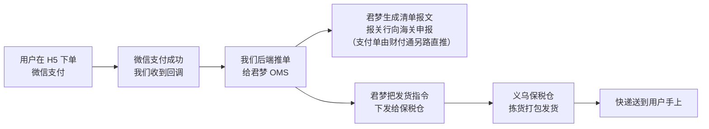
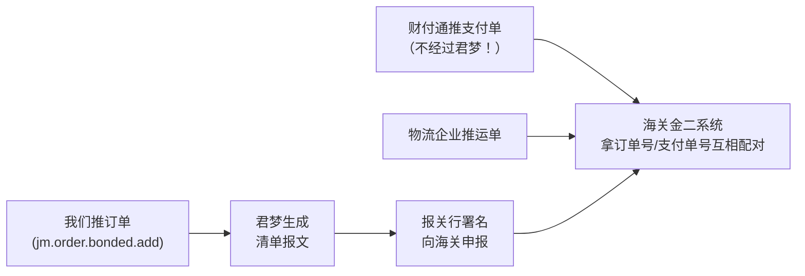

# 跨境进口白话入门（新手版）

> 给刚入行的人看的白话教程：不追求严谨完备，只求“读完能在脑子里把整条链路走一遍”。
> 需要严谨细节时看进阶版：[跨境进口全链路角色地图](./跨境进口全链路角色地图.md)（迭代式文档，持续追加）。
> 背景：本文整理自 WELLBIORA H5 商城对接过程中的真实调研与踩坑（2026-09-19）。

## 一句话总览

我们开的是一家卖保健品的 H5 网店，但**货从来不经我们的手**——货躺在义乌的保税仓里，我们只负责“卖相 + 收钱 + 把订单数据报给海关和仓库”，发货是仓库干，收税放行是海关干。

## 一笔订单的旅程

用户点“去支付”之后，幕后发生的事：

整条链上，**只有 B→C 这一步是我们写代码**（已经写好了）。其余环节我们最多是“查询进度”。

## 链路上有哪几个“盒子”

| 盒子 | 是什么 | 一句话职责 |
|---|---|---|
| **H5 商城（我们）** | 自己开发的网站 + 后台 | 展示商品、收钱退款、收集实名信息、支付成功后把订单推出去 |
| **微信支付/财付通** | 支付通道 | 收钱，并把“支付单”数据推给海关 |
| **君梦 OMS** | 仓库用的订单管理**软件**（杭州君梦供应链公司的产品） | 数据管道：接我们的订单 → 报海关 + 指挥仓库发货 |
| **义乌保税仓（典艺公司）** | 真正存货、碰货的地方 | 拣货打包，交给快递；报关行也在这边 |
| **海关** | 监管方 | 比对“三单”，收税，放行 |

## 君梦 OMS 到底是什么

新手最容易在这里犯迷糊，单独展开讲：

- 它是**软件，不是仓库**。仓库是义乌典艺公司；君梦是典艺用的订单管理系统（OMS = Order Management System）。
- 它**不碰货；也不是报关的"责任主体"**。货在仓库手里，申报清单上署名担责的是保税仓/报关行；但申报清单里的订单数据报文（金二格式）由君梦生成并传输——**数据经过它，责任不在它**。
- 它**有网页版操作后台**（仓库的运营人员天天在里面审单、处理异常、建商品档案），也有开放接口（OpenAPI）给我们这种外部商城推单用。
- 类比：君梦像小区的快递柜系统——柜子（仓库）是物业的，但你寄件取件都通过这套系统交互。

## “报关”其实是三张单，不是一件事

海关放行前要核对**三单一致**（俗称“三单对碰”），这三张单来自三个不同的方向：

| 单据 | 谁传给海关 | 我们要不要写代码 |
|---|---|---|
| **订单**（买了什么） | 我们 → 君梦 → 随申报清单传 | 要，就是推单那一个接口 |
| **支付单**（真的付钱了） | 财付通传 | 代码已写好：调微信的“报关”接口触发（自助清关） |
| **运单**（真的发货了） | 仓库/物流传 | 不用 |

三单里的订购人、支付人、收货人必须是同一个人（实名 + 身份证号就是这么来的），这是海关的硬要求，也是我们下单页要做实名校验的原因。

## 三单对碰到底验什么参数（第 2 轮）

先回答一个新手必问的问题：**订单里不是也有支付单号吗，为什么还要财付通单独传支付单？**

因为**信息来源的独立性**：订单是我们自己报的，海关不能只信一面之词（刷单、写低金额逃税、拆单绕限额都靠自报数据造假）；支付单是持牌第三方（财付通）报的，是"独立证人"。订单里的 `payNo` 只是编号，相当于"我们自己说付过钱"；海关要的是支付机构**亲自出具的确认**——就像打官司，自己的转账截图不算数，要银行盖章的流水。运单同理，是物流侧的独立证明。

三单各带的核心字段与海关的验证点：

**先认两个号（配对的钥匙，全链路同名不同叫）**：一笔订单有两个号——**我方订单号**（WB2026…，我方库 `order_no`，微信侧叫 `out_trade_no`，推君梦叫 `batchNo`）和**微信支付交易单号**（4500…，微信侧叫 `transaction_id`，我方库 `wechat_transaction_id`，推君梦叫 `payNo`）。支付单和清单里**两个号都带**，海关双向配对（订单号↔订单号、交易单号↔交易单号），双保险。

**① 订单单**（我们推君梦，随申报清单进金二；字段出自 `jm.order.bonded.add`）

| 我们传的字段 | 海关验什么 |
|---|---|
| `goods_no` + `number` | 商品在跨境电商**正面清单**内（备案 SKU）、真实存货 |
| `total`（含税总额） | **单笔 ≤ 5000 元**；综合税的**计税基础** |
| `idcard` + `idcardName` | 按身份证号累计**年度 ≤ 26000 元** |
| `payId` + `payNo` | `payId`=支付企业代码（财付通 4403169D3W）；`payNo`=`transaction_id` 微信交易单号——与支付单**配对的"胶水"** |
| `consignee` + 地址 | 收货人信息（与运单比对） |

**② 支付单**（我们调微信报关接口触发，财付通推海关；字段出自我方 `wechat-customs.service.ts` 实际提交的报文）

| 报文字段 | 海关验什么 |
|---|---|
| `out_trade_no` + `transaction_id` | `out_trade_no`=我方订单号（WB2026…）、`transaction_id`=微信交易单号（4500…）——与清单里的 `batchNo` + `payNo` **双向配对** |
| 支付**实际金额** | 与订单 `total` **金额一致**（防低报逃税） |
| `cert_id` + `name`（订购人身份证 + 姓名） | **支付人 = 订购人**（回执里的 `cert_check_result: SAME` 就是这项的验证结果） |

**③ 运单**（仓库/物流推）

| 字段 | 海关验什么 |
|---|---|
| 物流单号 + 揽收/出库记录 | 货**真的发出去了**（防空单刷单） |
| 收件人姓名地址 | **收货人 = 订购人 = 支付人**（跨境电商零售进口只允许个人自用，防代购/二次销售） |

一句话总结三单对碰：**三个独立信源交叉验证"人一致（订购=支付=收货）、款一致（订单金额=支付金额）、货真实（运单存在）"**，任何一环对不上就不放行。

**为什么"君梦不报关"和"订单经君梦传海关"不矛盾**：报关是法律行为，署名担责的申报主体是保税仓/报关行；但申报清单里的订单数据报文由君梦生成传输——**数据经过它，责任不在它**。类比：通过顺丰寄合同，合同的法律效力是你的，顺丰只负责把纸送到。

## 申报清单：一笔订单的"报关单"（第 3 轮）

"随申报清单进金二"这句话拆开解释：

- **金二 = 金关二期**，海关内部的通关作业系统。
- **申报清单 =《跨境电子商务零售进口进境物品清单》**。保税模式（1210）下每笔订单单独申报，不能像传统外贸整批报——**一张清单 = 一笔订单的"报关单"**，用户买 3 单就是 3 张清单。
- **清单不是我们填的，也不是我们推的**。我们只把订单数据推给君梦；君梦据此生成清单报文，**报关行（仓库侧）署名向海关申报**。

> **⚠️ 关键纠错（第 4 轮）**：三张单**不在君梦"拼表"，在海关系统里配对**。支付单由财付通**直推海关、完全不经过君梦**——君梦拿到的只是我们推单报文里的一个支付单号（`payNo`），把它写进清单当"配对钥匙"。真正把三张单对上号的是海关。此前版本"君梦把三个来源的数据拼成一张表"是错误表述。

清单里有什么（按数据来源）：

| 来源 | 进清单的字段 | 我们推单时的对应字段 |
|---|---|---|
| **我们（经君梦写入）** | 订单号 | `batchNo` |
| | 电商平台代码 | `plaformCode`（5101960X8F） |
| | 订购人姓名 + 身份证号 | `idcardName` + `idcard` |
| | 收货人 + 电话 + 地址 | `orderAddress` 一组 |
| | 商品明细（备案商品编号→HS 编码/品名/原产国由海关备案档案带出，**我们不用传**） | `goods_no` + `number` |
| | 商品单价/总价（计税基础） | `goods[].total` |
| | 运费 / 优惠 | `frightFee` / `disCount` |
| | 支付单号（**只是号码**，支付单本身由财付通另路直推海关） | `orderCustoms.payNo` |
| **仓库侧填** | 运单号、物流企业代码、申报单位（报关行）、清单编号 | 我们完全不碰（税款由海关按 total 自动算） |

两个避混淆点：

1. **君梦 API 里的"金二入库单/出库单"接口 ≠ 这张清单**——那是仓库账册（存货台账）的事；清单申报发生在仓库的报关系统里，君梦 API 文档里根本没有清单接口（再次印证"清单不是我们报"）。
2. 以上字段结构是海关总署 2018 年 194 号公告的标准框架，**实际报文以仓库申报系统为准**——建议向仓库商务要一张脱敏样单核对（可加入待确认清单）。

## 一切的前提：商品备案，以及"到底谁推什么给海关"（第 4 轮）

### 问 1：是不是所有 SKU 都要先海关备案？

**是，没有例外。** 运营 20 个 SKU，就要有 20 条备案（按规格级别，一款商品的两种规格算两条）。备案以泽芃铭名义、由保税仓的报关行代办。没备案的 SKU：推单/清单申报会被海关退回，寸步难行。

备案之前还有个更前置的门槛：商品要在跨境电商零售进口**正面清单**（允许按此模式进口的商品目录）内——保健品多数在，但每个 SKU 都要逐个核对。

### 问 2：微信报关（自助清关）是以谁的名义？

**泽芃铭。** 代码调接口用的是我们的微信支付商户号（1117333649，泽芃铭名下）+ 海关备案号 5101960X8F（`mch_customs_no`）——财付通据此把**这个商户**的支付数据推给海关。商户号、海关备案、报关触发三者锚定同一主体，海关才能做"支付人 = 订购人"的校验。

### 问 3：申报清单谁推？我们和保税仓都要推海关吗？

**我们从头到尾不直接推任何东西给海关。** 我们往外发的只有两样，且都发给企业而非海关：订单数据 → 君梦；报关触发指令 → 财付通。到了海关那侧，各有各的"信使"：

| 传到海关的单 | 技术上谁推 | 名义/责任主体 | 我们写代码吗 |
|---|---|---|---|
| 订单（随清单） | 君梦生成报文，**报关行（典艺侧）申报** | 电商企业 = 泽芃铭（清单上署明） | 只写"推单给君梦"这一步 |
| 支付单 | 财付通 | 商户主体 = 泽芃铭 | 写"调微信报关接口触发"（已写好） |
| 申报清单 | 报关行 | 申报单位 = 报关行；电商企业 = 泽芃铭 | 不写（不经过我们） |
| 运单 | 物流企业 | 物流企业 | 不写 |

所以**不存在"我们和保税仓都推海关"**——我们的职责到"把数据交给信使"为止；清单、运单的推送主体分别是报关行和物流企业，但清单上的"电商企业"永远是泽芃铭，申报真实性的责任甩不掉。

## 179 是什么？为什么是“我们的事”

**179 = 海关总署 2018 年第 179 号公告**，要求跨境电商平台把交易数据（订单）接入海关的数据抓取平台。

三个新手常见误区，一次说清：

1. **它不是一段代码，是一次“登记”**——以电商平台企业的名义向海关完成对接登记。君梦的 API 文档里没有任何 179 相关接口，翻烂了也没有。
2. **义务方是电商平台企业**，本项目里就是泽芃铭（海关备案号 5101960X8F）。所以海关回执报错点名的也是它：`电商平台[5101960X8F]未按照海关总署179号公告要求完成跨境进口数据抓取平台的对接`——没完成它，订单申报会被拦下（状态 EXCEPT）。
3. **“责任是我们的” ≠ “我们自己动手”**——名义必须以泽芃铭做，但跑腿可以委托保税仓/报关行/君梦这类服务商代办（就像商品海关备案也是报关行代办、以泽芃铭名义一样）。**对接前先问仓库商务能不能代办、要什么材料。**

## goods_no：商品的“仓库身份证”

一款商品要能卖，要走四步（前两步在仓库那条线，不经过我们）：

| 步骤 | 在哪办 | 谁跑腿 | 产出 |
|---|---|---|---|
| ① 商品海关备案 | 海关（以泽芃铭名义） | 保税仓的报关行代办 | 这个 SKU 允许按跨境电商进口申报 |
| ② 备货入保税仓 | 义乌保税仓 | 我们把货发过去，仓库清关入区 | 货躺在仓里，有库存 |
| ③ OMS 建商品档案 | 君梦 OMS | **仓库商务操作**（我们没权限也不该有） | **goods_no 在这一步生成** |
| ④ H5 商城上架 | 我们自己的后台 | 我们自己 | 商品 ID（WB10001…）+ 详情 + 价格，**并手工填入对应的 goods_no** |

> 注：①②③ 的先后顺序各处口径不一（君梦客服说「备案→入仓→建档」，实际也可能先建档后备货），以仓库商务的书面答复为准。不变的是：**goods_no 产生于"建档"这个动作**，我们在 H5 侧只做映射，不自己生成。

所以 goods_no 的用法就一句话：**仓库在君梦里建档时分配 → 仓库商务发给你 → 你在后台商品编辑页的「仓库 goods_no」字段里手工填一次 → 之后推单代码自动带上**。

拿到君梦 API 正式参数后，可用商品档案查询接口（`jm.goods.get`）核对一遍，防止手抄出错。

## H5 开发者的职责清单

从全局视角收个尾，我们作为 H5 开发方，全部职责就这几件：

**日常代码职责（四件事）**

1. 卖相展示：商品详情、内容块渲染
2. 收款退款：微信支付/退款
3. 收集申报要素：实名（姓名 + 身份证）、限额校验（单笔 ≤ 5000 元、年度 ≤ 26000 元）
4. 支付成功后推订单给君梦（唯一的对外代码活）

**注册/登记类职责（不是代码，但名义在我们）**

- 商品海关备案（报关行代办，以泽芃铭名义）
- 179 数据抓取平台对接（待办，优先问仓库能否代办）

**申报真实性与税的责任**：在电商企业（泽芃铭）身上。所以促销价低于海关备案价这类动作要先向海关申请，不能运营随手改。

## 术语小词典

| 术语 | 白话解释 |
|---|---|
| goods_no | 商品在君梦/仓库侧的编码，“仓库身份证”；由仓库商务建档时分配 |
| warehouseNo / shopId | 君梦推单参数：发哪个仓、哪个店铺；在君梦客户端里查 |
| plaformCode | 平台在海关总署的编码（注意是官方原始拼写，少个 t）；本项目 = 5101960X8F |
| 三单对碰 | 海关比对订单、支付单、运单，三者人货款一致才放行 |
| 金二（金关二期） | 海关的电子口岸系统，所有申报数据最终进这里 |
| 179 | 海关总署 2018 年 179 号公告，电商平台的数据对接义务 |
| 1210 保税备货 | 跨境进口模式之一：货先进保税仓存着，卖出去了再清关发货 |
| OMS | Order Management System，订单管理系统；本项目里指君梦 |
| WMS | Warehouse Management System，仓库管理系统；君梦的下游，仓库真正用来拣货的系统 |

---

## 迭代记录

### 第 1 轮（2026-09-19）

- 整理内容：君梦 OMS 的本质（软件/数据管道，非仓库非报关行）、是否有界面（有，仓库侧用）、“报关”拆成三单、179 的责任主体与代办路径、goods_no 四步生命周期与后台落地方式。
- 关键结论：H5 开发方唯一的对外代码活是"支付成功后推单"；179 是登记动作不是代码，义务方 = 泽芃铭，可委托代办，当前上线链路第一优先级。

### 第 2 轮（2026-09-19）

- 整理内容：三单对碰的具体验证参数（订单单 / 支付单 / 运单各自的字段表与验证点）；"为什么订单之外还要单独传支付单"（信息来源独立性：自报数据 vs 持牌第三方独立证明）；`cert_check_result: SAME` 的含义（支付人=订购人核验结果）。
- 修正一处易误导表述：君梦"不碰货、不报关"改为"不碰货、非报关责任主体"——申报清单署名担责的是保税仓/报关行，但清单中的订单数据报文由君梦生成传输，**数据经过它、责任不在它**。

### 第 3 轮（2026-09-19）

- 整理内容："随申报清单进金二"拆解——金二=金关二期海关通关系统；申报清单=《跨境电子商务零售进口进境物品清单》，一张清单=一笔订单的"报关单"，由仓库侧拼装三来源数据（我方订单字段/财付通支付单/仓库运单）经电子口岸申报；清单字段三来源对照表（含我方推单字段与清单字段的逐一对应）。
- 关键认知：我方推单的每个字段都直接进申报清单（这就是推单是"唯一代码活"的原因）；goods_no 是"钥匙"——HS 编码/品名/原产国由海关备案档案带出，我方不用传；君梦 API 的"金二入库/出库单"是仓库账册事务，与这张清单无关。
- 遗留待办：向仓库商务要一张脱敏清单样单核对实际报文字段。

### 第 4 轮（2026-09-19）

- **纠错**：第 3 轮"君梦把三个来源的数据拼成一张表"是错的——支付单由财付通**直推海关、不经过君梦**，君梦只拿到我方推单报文里的支付单号（payNo）写进清单当"配对钥匙"；三张单的配对发生在海关系统内。文内图和表述已修正。
- 新增三问答：①商品海关备案是 SKU 级硬前提（20 个 SKU = 20 条备案，更前置的是正面清单核对）；②微信报关以泽芃铭名义（商户号 1117333649 + 海关备案号 5101960X8F 同主体锚定）；③"谁推什么给海关"总表——我方从不直接推海关，只把订单推君梦、报关触发调财付通；清单=报关行申报、运单=物流企业推，但清单上"电商企业"永远署泽芃铭。
- 补字段名对照（应项目要求，后续表述一律带字段名）：一笔订单两个号——我方订单号（库 `order_no` / 微信 `out_trade_no` / 君梦 `batchNo`）与微信交易单号（微信 `transaction_id` / 库 `wechat_transaction_id` / 君梦 `payNo`）；支付单与清单两个号都带，海关双向配对。
