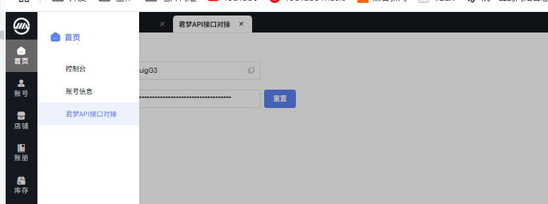
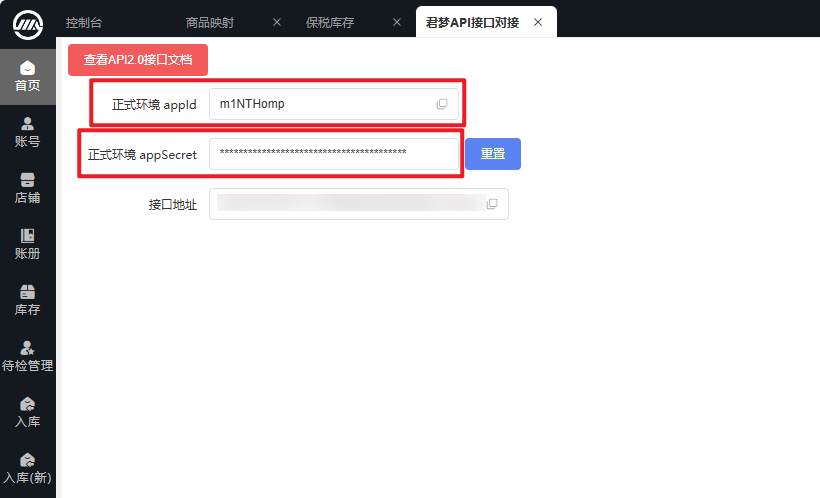
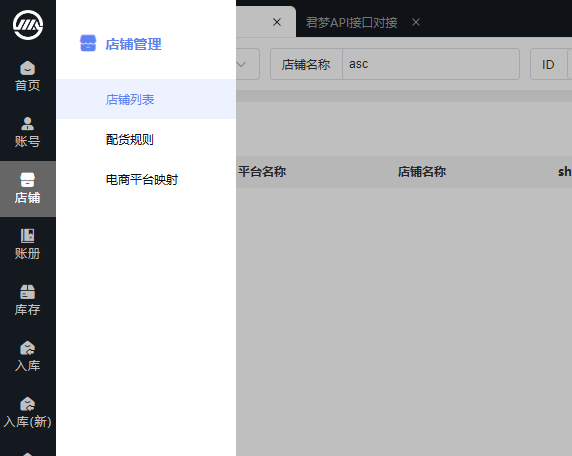
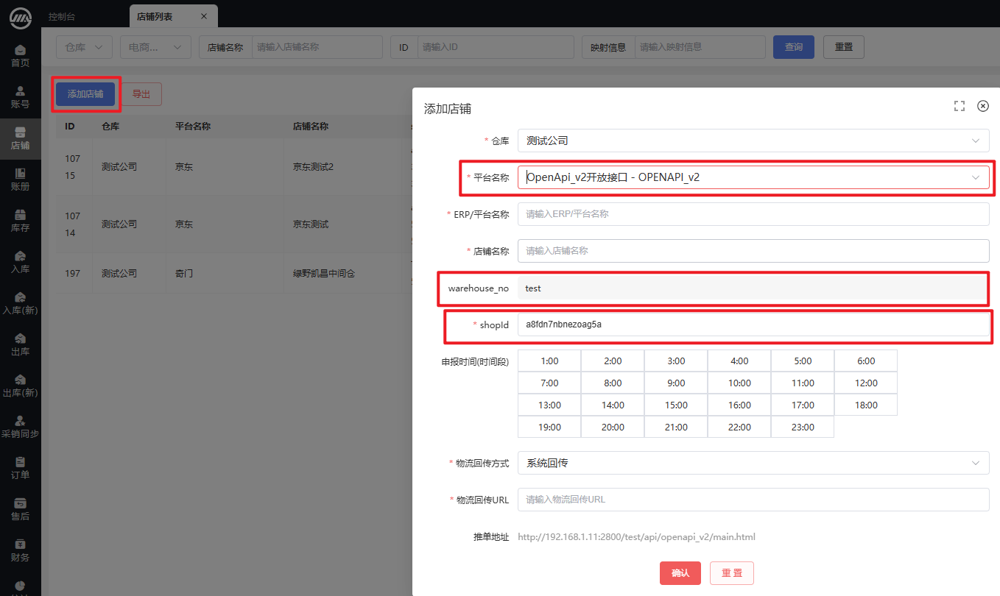

# 更新记录

| 版本 | 更新时间 | 内容 |
|---|---|---|
| V 1.0.0 | 2025-01-01 | 新增v2接口 |
| V 1.0.1 | 2025-11-24 | 出库/入库返回字段新增remark（备注） 进入出入库新增查询字段status（单据状态） |
| V 1.0.2 | 2025-12-19 | 统一订单相关接口平台单号字段 |
| V 1.0.3 | 2026-07-09 | 订单查询新增出库时间条件 |

## 接口规范

OpenAPI 口接均采用  POST  application/json 方式请求

OpenAPI timestamp 参数有效期： 五分钟内

## 公共参数





请求地址

| 环境 | HTTP地址 | HTTPS地址 |
|---|---|---|
| 测试环境 | 无 | https://api.jmcompany.cn/test/test/api/openapi_v2/main |
| 生产环境 | 无 | https://api.jmcompany.cn/#server/#mechanism/api/openapi_v2/main |

说明： 生产环境HTTPS地址中的#server #mechanism 为占位符，具体填写字符信息请到君梦客户端开放平台获取

# 公共参数

# 推单参数（shopId/warehouseNo）





## 加签规则

##### 参数说明(正式参数请至系统中获取，申请模块，见上图)

appId = mXyuigG3

appSecret = 8575ed0526b46860de4039dc609bf5c31e76e9f5

warehouseNo：test

shopId：exrzyuytjtcc7tgo

商品编码：LLL58973649236test

电商平台：杭州有赞科技有限公司（3301961SWG）

请求参数参数

{  "appId": "mXyuigG3",  "method": "jm.store.in.get",  "params": {    "pageNo": 1,    "pageSize": 1  },  "timestamp": "1732510105798",  "sign": "abcd"}

去除sign和params 获得以下参数

{  "appId": "mXyuigG3",  "timestamp": "1732510105798",  "method": "jm.store.in.get"}

按key值字符顺序排序

{  "appId": "mXyuigG3",  "method": "jm.store.in.get",  "timestamp": "1732510105798"}

按key=value&方式拼接，得到以下字符串

appId=mXyuigG3&method=jm.store.in.get&timestamp=1732510105798

一步获得的字符串 + appSecret 得到待加签字符串

appId=mXyuigG3&method=jm.store.in.get&timestamp=17325101057988575ed0526b46860de4039dc609bf5c31e76e9f5

将待签名字符串MD5加密后转大写放入请求参数 sign传入服务器

md5(appId=mXyuigG3&method=jm.store.in.get&timestamp=17325101057988575ed0526b46860de4039dc609bf5c31e76e9f5).toUpperCase()

## 加签代码示例

```java
import java.util.TreeMap;class SignDemo {    public static void main(String[] args) {        Map<String, Object> requestPrarmMap = new TreeMap<>();        requestPrarmMap.remove("params");        String preSignStr = createLinkString(requestPrarmMap);        String _sign = MD5Utils.getMD5(preSignStr + customerInfoPOJO.getF_app_secret());        convertClassToMap(request);    }    public static Map<String, String> convertClassToMap(Object obj) {        Map<String, String> resultMap = new HashMap<>();        Class<?> clazz = obj.getClass();        Field[] fields = clazz.getDeclaredFields();        for (Field field : fields) {            field.setAccessible(true);            String value = null;            try {                value = field.get(obj).toString();            } catch (IllegalAccessException ignored) {            }            resultMap.put(field.getName(), value);        }        return resultMap;    }    public static String createLinkString(Map<String, String> params) {        Map<String, String> sortedMap = new TreeMap<String, String>(params);        return sortedMap.entrySet().stream()                .map(entry -> entry.getKey() + "=" + entry.getValue())                .collect(Collectors.joining("&"));    }}

public class MD5Utils {    static char[] hexDigits = {'0', '1', '2', '3', '4', '5', '6', '7', '8',            '9', 'a', 'b', 'c', 'd', 'e', 'f'};    public static String getFileMD5(InputStream fis) {        MessageDigest md = null;        try {            md = MessageDigest.getInstance("MD5");        } catch (NoSuchAlgorithmException e) {            e.printStackTrace();        }        byte[] buffer = new byte[2048];        int length = -1;        long s = System.currentTimeMillis();        try {            while ((length = fis.read(buffer)) != -1)                md.update(buffer, 0, length);        } catch (IOException e) {            e.printStackTrace();            try {                fis.close();            } catch (IOException ex) {                ex.printStackTrace();            }        } finally {            try {                fis.close();            } catch (IOException ex) {                ex.printStackTrace();            }        }        System.err.println("last: " + (System.currentTimeMillis() - s));        byte[] b = md.digest();        return byteToHexStringSingle(b);    }    public static String getFileMD5(File file) {        try {            return getFileMD5(new FileInputStream(file));        } catch (FileNotFoundException e) {            e.printStackTrace();        }        return null;    }    public static String getMD5(String message) {        try {            MessageDigest md = MessageDigest.getInstance("MD5");            byte[] b = md.digest(message.getBytes("utf-8"));            return byteToHexStringSingle(b);        } catch (NoSuchAlgorithmException e) {            e.printStackTrace();        } catch (UnsupportedEncodingException e) {            e.printStackTrace();        }        return null;    }    public static String byteToHexStringSingle(byte[] byteArray) {        StringBuffer md5StrBuff = new StringBuffer();        for (int i = 0; i < byteArray.length; i++) {            if (Integer.toHexString(0xFF & byteArray[i]).length() == 1)                md5StrBuff.append("0").append(                        Integer.toHexString(0xFF & byteArray[i]));            else {                md5StrBuff.append(Integer.toHexString(0xFF & byteArray[i]));            }     }        return md5StrBuff.toString();    }}
```
